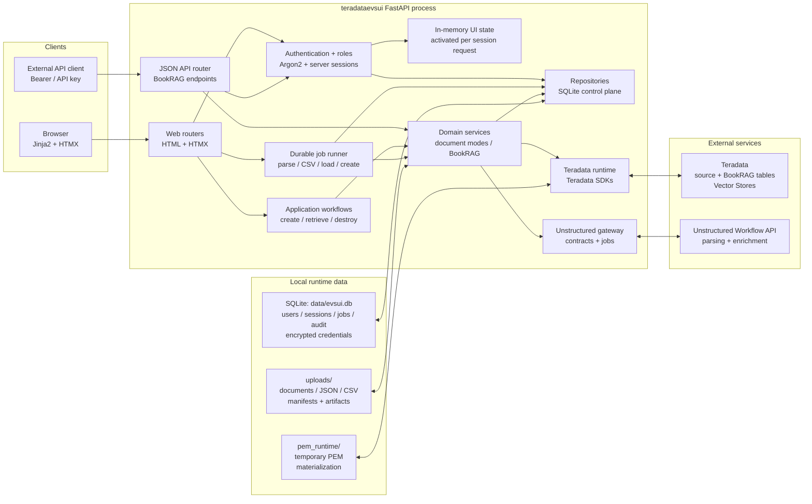
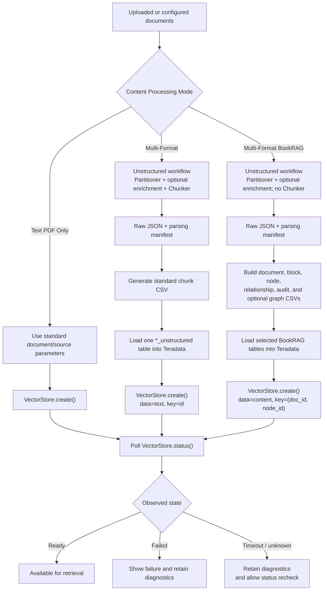
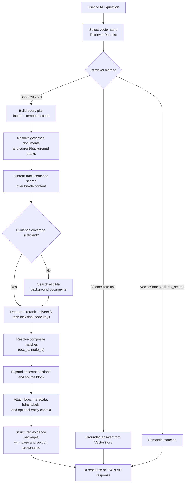
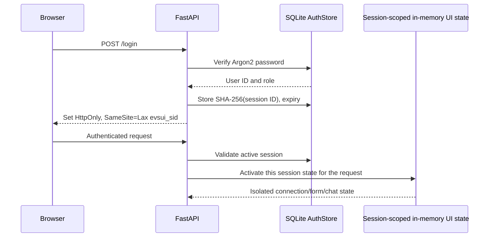

# teradataevsui — Teradata Vector Store UI

> **Language:** English | [日本語](README_ja.md)

Teradata Vector Store provides vector-search and retrieval capabilities on top of Teradata data. It stores document chunks and embeddings as managed vector stores, then exposes operations for creation, health checks, listing, deletion, semantic similarity search, and grounded Q&A through `VectorStore` and `VSManager`.

teradataevsui is a `FastAPI + Jinja2 + HTMX` interface for working with Teradata Vector Store. It helps users select reusable Teradata connections, create vector stores from uploaded or configured sources, validate retrieval, govern BookRAG document metadata, and manage encrypted shared service credentials.

## License and ownership

The proposed [Teradata Product-Restricted Source-Available License](LICENSE)
has a [Japanese reference translation](LICENSE_ja.md). The English proposal
declares Teradata ownership of the covered project materials and limits use,
modification, and redistribution to solutions based on or used with Teradata
products. Standalone use or adaptation for non-Teradata products requires
separate written permission. Supporting third-party dependencies retain their
own licenses; Teradata products still require their own licenses and access rights.

These are **draft terms pending Teradata's confirmation of ownership and approval**,
not a claim of an existing official Teradata license. This is a source-available,
product-restricted proposal, not an OSI-approved open-source license.

## Contents

- [Getting Started](#getting-started)
- [License and ownership](#license-and-ownership)
- [Using teradataevsui](#using-teradataevsui)
- [Overall Design](#overall-design)
- [Feature Overview](#overview)
- [Runtime Dependencies](#runtime-dependencies)
- [Unstructured Configuration](#unstructured-configuration-reference)
- [BookRAG Data Contract](#bookrag-data-and-relationship-contract)
- [BookRAG API](#bookrag-api-notes)
- [Authentication and Local Configuration](#authentication-and-local-configuration-reference)
- [Multi-user Administration](#multi-user-administration)
- [Project Structure and Routes](#project-structure)
- [First installation](docs/installation.md)
- [Architecture](docs/architecture.md)
- [Operations](docs/operations.md)
- [SQLite schema](docs/database_schema.md)

Every public document is maintained as an English source and a complete Japanese
counterpart. Use the language switch at the top of a document; CI rejects missing,
structurally divergent, or stale translations.

## Getting Started

For a complete empty-machine procedure covering Windows PowerShell, Linux x86-64, native production startup, and Docker Compose, follow the [First Installation Guide](docs/installation.md). The steps below are the shorter native-development path.

The project/package is now named `teradataevsui`. The supported CLI commands are
`teradataevsui-db` and `teradataevsui-ops`; the old `evsui-db` and `evsui-ops`
commands remain compatibility aliases.
Existing `EVSUI_*` environment variables, `data/evsui.db`, its credential key, and
session cookies retain their names so existing installations keep their configuration
and encrypted data. No database migration or credential re-entry is needed for this rename.
The GitHub repository is now `https://github.com/xuhaibintd/teradataevsui`.
For an existing checkout, update its remote with
`git remote set-url origin https://github.com/xuhaibintd/teradataevsui.git`.
After moving or renaming the local project directory, run
`uv venv --clear --python 3.11 --no-python-downloads` followed by the appropriate
locked sync: virtual-environment launchers and editable
installs can contain absolute paths. Keep `data/`, its credential key, and `uploads/` intact.

### Prerequisites

Before installing teradataevsui, make sure you have:

- Windows AMD64 or Linux x86-64. Other operating systems and CPU architectures
  are not part of the locked, tested support matrix.
- Python 3.11. The supported range is intentionally limited to Python 3.11 so
  local development, CI, and the production image use the same interpreter series.
- [uv](https://docs.astral.sh/uv/getting-started/installation/) 0.12.10 for
  locked, exact dependency synchronization.
- Git, if you are cloning the repository.
- Network access to a Teradata system and these Teradata credentials:
  - database host, username, and password;
  - UES URL, normally ending in `/open-analytics`;
  - PAT token;
  - PEM, key, or certificate file when required by the target environment.
- An Unstructured API URL and API key only if you plan to use `Multi-Format` or `Multi-Format BookRAG`. `Text PDF Only` does not use Unstructured.

### 1. Get the code

```bash
git clone https://github.com/xuhaibintd/teradataevsui.git
cd teradataevsui
```

If you already have the repository, run the remaining commands from its root directory (the directory containing `pyproject.toml` and `uv.lock`).

### 2. Synchronize the locked runtime environment

Windows PowerShell:

```powershell
uv sync --locked --no-dev
```

Linux x86-64:

```bash
uv sync --locked --no-dev
```

`uv` creates `.venv` when necessary and performs an exact synchronization. Any
package that is not part of the selected lock-file dependency set is removed,
so repeated maintenance does not accumulate orphan packages.

### 3. Configure the first administrator

teradataevsui stores users and server-side sessions in SQLite. The database is created automatically at `data/evsui.db`; Python's built-in SQLite driver requires no separate database installation. On a new installation, start the application and open it in a browser. If no users exist, the application opens **Create administrator** and asks for the initial username, password, and password confirmation. The one-time setup page closes as soon as the administrator is created.

For an unattended deployment, you can create the first administrator from environment variables before the first start:

Windows PowerShell:

```powershell
$env:EVSUI_BOOTSTRAP_ADMIN = "admin"
$env:EVSUI_BOOTSTRAP_PASSWORD = "replace-with-a-strong-password"
```

Linux x86-64:

```bash
export EVSUI_BOOTSTRAP_ADMIN=admin
export EVSUI_BOOTSTRAP_PASSWORD='replace-with-a-strong-password'
```

The browser setup and environment-variable setup both require a password of at least eight characters. The password is stored only as an Argon2 hash. After the administrator exists, the setup page and bootstrap variables cannot update or overwrite it. Use **System Configuration** in the top bar to manage database connection profiles and accounts.

For optional Teradata and Unstructured defaults, copy `app/config/local_dev.example.json` to `app/config/local_dev.json`. The login section is retained only for first-run migration from older installations. A representative local configuration is:

```json
{
  "login": {
    "username": "",
    "password": "",
    "users": {}
  },
  "connection": {
    "host": "",
    "username": "",
    "password": "",
    "ues_url": "",
    "pat_token": "",
    "pem_file": ""
  },
  "unstructured": {
    "api_key": "",
    "api_url": "https://platform.unstructuredapp.io/api/v1"
  }
}
```

On an empty SQLite database, legacy users from `app/config/local_dev.json`, `app/config/auth_users.json`, `POC_AUTH_FILE`, or the old `POC_ADMIN_USER`/`POC_ADMIN_PASSWORD` variables are imported once. The first imported user becomes `admin`; later imported users become `operator`. New interactive installations should use **Create administrator**; unattended installations can use the `EVSUI_BOOTSTRAP_*` variables.

The legacy `connection` values are imported once as the default database connection profile when no system configuration exists. After verifying the imported values, remove them from the JSON file. Administrators can create, edit, delete, and select a default profile under **System Configuration → Database Connections**. The home page lets users select one of these profiles before connecting. The `unstructured.api_key` may remain blank unless you use a multi-format mode.

`app/config/local_dev.json` is ignored by Git. Keep real passwords, PAT tokens, API keys, and certificate files out of version control.

`data/evsui.db` is also intentionally ignored: it contains environment-specific users, encrypted credentials, sessions, and operational state. A fresh checkout creates the complete schema from versioned migrations. Back up and deploy the database as runtime data, not source code; see [Operations](docs/operations.md).

### 4. Start teradataevsui

Start the web application in a terminal:

```bash
uv run --locked --no-sync python -m uvicorn app.main:app --reload --host 127.0.0.1 --port 8010
```

The application automatically executes one durable background job at a time.
Document parsing, CSV loading, and Vector Store creation are queued in SQLite and
rendered through UI polling, so they continue if the browser request ends. No second
process or command is required.

Open <http://127.0.0.1:8010> and sign in with the credentials configured in the previous step. The `--reload` option is intended for local development.

To verify that the web process is running:

```bash
curl http://127.0.0.1:8010/healthz
```

Windows PowerShell can use:

```powershell
Invoke-RestMethod http://127.0.0.1:8010/healthz
```

The expected response is `{"status":"ok"}`. This endpoint checks the teradataevsui process only; use **Refresh management data** after connecting to verify Teradata Vector Store access.

## Using teradataevsui

### Connect to Teradata

1. Sign in to teradataevsui and open **Connect & Manage**.
2. An administrator creates the reusable profile once under **System Configuration → Database Connections**, including the database, UES, and certificate credentials required by the environment. Secrets and PEM contents are encrypted in SQLite.
3. Select a saved **Database connection** profile. The page shows a read-only summary without exposing its secrets.
4. Select **Connect**. A successful result confirms both database context creation and Vector Store authentication.
5. Select **Refresh management data** to load Vector Store health, the installed `teradatagenai` version, compatibility warnings, and the unified six-column **Vector stores** inventory. This refresh does not run automatically after connecting.
6. Filter rows or select a resource locally to set the current action target; this selection does not issue a remote request. Administrators can separately load active EVS sessions and disconnect all active EVS sessions for the selected users.

### Create a vector store

1. Open **Vector Store Creation** and upload one or more documents.
2. Select a **Content Processing Mode**:
   - **Text PDF Only** sends the configured PDF/document source through the standard `VectorStore.create()` flow.
   - **Multi-Format** uses Unstructured, generates the standard chunk table, and then creates a vector store from that table.
   - **Multi-Format BookRAG** uses Unstructured and builds document-scoped BookRAG tables before vector creation.
3. Set the Vector Store name, embeddings model, search algorithm, and any mode-specific settings.
4. For either multi-format mode, complete the three visible stages in order: **Document Parsing**, **Generate CSV from JSON**, and **Load CSV to Unstructured Table** or **Load CSV to Tables**. Then select the table-ready run shown in the Vector Store name field.
5. Select **Create Vector Store** and wait until the background job reports `Ready` or `Failed`. The default readiness timeout is two hours and can be changed with `EVS_VECTORSTORE_READY_TIMEOUT_SECONDS`.

For the uploaded-file `Text PDF Only` flow, the UI does not populate `object_names` automatically. Supply the source fields required by your Teradata Vector Store configuration.

### Retrieve and review results

1. Open **Vector Store Retrieval**.
2. Select **Run List** to refresh the retrieval-specific list, then choose a vector store. The management and retrieval lists refresh independently.
3. Choose `VectorStore.ask`, `VectorStore.similarity_search`, or **BookRAG API**, enter a question, and select **Send**.
4. Use **System Configuration** to manage shared encrypted Teradata and Unstructured credentials. For BookRAG stores, use **BookRAG Governance** to manage document metadata and relationships.

### Common startup problems

- **Create administrator keeps appearing**: the user table is still empty. Complete the one-time form, or set both `EVSUI_BOOTSTRAP_ADMIN` and `EVSUI_BOOTSTRAP_PASSWORD` before restarting for unattended setup.
- **`uv` is not available**: run `uv --version` and install `uv` or correct `PATH` before using the launch command. The documented `uv run` flow does not require manual virtual-environment activation.
- **Unstructured API key missing**: an administrator must save the shared endpoint and API key under **System Configuration → Unstructured IO**.
- **Teradata connection fails**: ask an administrator to verify the selected saved profile's Host, Username, Password, UES URL, PAT Token, and any required PEM/certificate data, then reconnect with that profile.
- **A vector store does not appear in Retrieval**: select **Run List** on the Retrieval page; the Connect & Manage list does not update it.

## Overall Design

teradataevsui is a server-rendered web application running in one FastAPI process. Jinja2 renders complete pages and HTMX replaces page fragments for interactive operations. Web routes and JSON API routes share the same domain services, while integration modules isolate Teradata and Unstructured calls from UI code.

### Component architecture



The principal code boundaries are:

| Layer | Main location | Responsibility |
|---|---|---|
| Application entry | `app/main.py`, `app/core/` | App factory, typed settings, security headers, error handling, and Teradata runtime isolation |
| Web delivery | `app/routers/web.py`, `app/routers/auth.py`, `app/routers/system_admin.py`, `app/templates/`, `app/static/` | Login, system configuration, HTML/HTMX endpoints, forms, and browser behavior |
| JSON API | `app/routers/api.py` | BookRAG schema, retrieval, answer, and health endpoints |
| Workflow orchestration | `app/workflows/` | Coordinates create, chat, and destroy operations |
| Domain services | `app/services/` | Document processing, manifests, BookRAG schema/tree/retrieval, and SQL helpers |
| Document-mode plug-ins | `app/services/doc_modes/` | Selects `Text PDF Only`, `Multi-Format`, or `Multi-Format BookRAG` behavior through one handler registry |
| Runtime integrations | `app/teradata_runtime.py`, `app/services/unstructured_runtime.py` | Loads external SDKs and resolves integration configuration |
| Unstructured boundary | `app/integrations/unstructured/` | Validates workflow contracts and exposes one stable gateway to submit, poll, diagnose, and download jobs |
| Persistence | `app/repositories/`, `app/db/` | SQLite repositories, numbered migrations, encrypted external-service configuration, jobs, artifacts, and online backup |
| Authentication | `app/auth_store.py` | Argon2 passwords, login lockout, roles, server sessions, legacy migration facade, and audit records |
| Session state | `app/session_state.py` | Uses context-local state so concurrent requests cannot swap user connection, form, upload, or chat state |

### Vector store creation paths

All creation modes converge on `VectorStore.create()`, but they prepare its source differently.



For both multi-format modes, parsing, JSON-to-CSV conversion, and Teradata loading are deliberately separate stages. Each stage writes a manifest with paths, checksums, row counts, and status. A later stage accepts only a verified `ready` manifest, so an Unstructured call does not need to be repeated when only transformation or loading must be retried.

### Retrieval path

Standard retrieval calls the selected Vector Store directly. BookRAG adds governed document scoping and reconstructs a traceable evidence package around each semantic match.



Detailed BookRAG table relationships and transformation rules are documented in [BookRAG Pipeline: Data Structures and Processing Flow](docs/bookrag_pipeline_diagram.md). The external SQL join contract should always be obtained from `GET /api/bookrag/schema` rather than inferred from table names.

### State and persistence model

- Users, roles, password hashes, reusable database connection profiles, shared Unstructured configuration, server-side sessions, jobs, artifact records, and audit records are persisted in `data/evsui.db`. Database passwords, PAT tokens, PEM contents, and external API keys are encrypted before they are written. A PEM is materialized only as a restricted runtime file when the SDK needs a filesystem path, using its original filename because Teradata derives the JWT `kid` from that name.
- Connection status, upload selections, and chat history remain process-local per `evsui_sid`. They are request-scoped and concurrent-user safe, but restarting the process resets this temporary UI state. The shared system connection is loaded from SQLite at login and before connecting.
- Session cookies contain only a random opaque ID. The server stores only its SHA-256 hash, applies an eight-hour default expiry, and revokes sessions on logout, password reset, or user disable.
- Uploaded documents, raw JSON, generated CSV files, and manifests are stored below `uploads/`. Encrypted PEM contents live in SQLite and restricted temporary materializations live below `pem_runtime/`.
- Vector stores, standard multi-format source tables, and BookRAG tables are persisted in Teradata.
- `data/`, `uploads/`, `pem_runtime/`, `.env`, local configuration, and legacy auth-user files are ignored runtime data and must not be committed.
- The UI exposes independent management and retrieval list refreshes by design; selecting or deleting in one panel does not silently change the other panel's current list.

## Overview

### Connect & Manage

- Database connection and authentication:
  - `create_context(host, username, password)`
  - `set_auth_token(base_url, pat_token, pem_file)`
- Management actions:
  - `VSManager.health()`
  - `VSManager.list()`
  - Select and run `VectorStore.destroy()`

### Vector Store Creation

- Supports multi-file upload
- Full `VectorStore.create(...)` parameter form
- Built-in parameter sets for `VECTORDISTANCE / KMEANS / HNSW`
- `Multi Format` mode uses Unstructured Workflow Endpoint on-demand jobs and a reusable three-stage flow: shared raw JSON, standard unstructured CSV, then `<Vector Store Name>_unstructured` table loading. BookRAG and Multi Format discover the same raw JSON runs; they diverge only at JSON-to-CSV transformation and table loading. The standard Multi-Format JSON-to-row mapping and table contract remain unchanged.
- `Multi-Format BookRAG` mode uses Unstructured Workflow Endpoint on-demand jobs with inline `job_nodes`, builds document-scoped Teradata tables, and can optionally run `VectorStore.create()` from `bnode.content` with `(doc_id, node_id)` as the vector key. See [BookRAG Pipeline: Data Structures and Processing Flow](docs/bookrag_pipeline_diagram.md) for the visual pipeline and table model.
- BookRAG is intended for long, structured documents when retrieved passages need section paths, pages, source blocks, and optional table/image/entity context. It provides traceable evidence candidates for review, but it does not by itself perform graph traversal, cross-document entity resolution, contradiction detection, or citation verification. See the industrial-use-case decision guide in [English](docs/bookrag_industrial_use_cases.md) or [Japanese](docs/bookrag_industrial_use_cases_ja.md).

### Vector Store Retrieval

- Supports `VectorStore.ask` and `VectorStore.similarity_search`
- Independent Run List dropdown for chat target vector store
- BookRAG retrieval uses semantic similarity over `bnode.content`. For questions without an explicit timeline, the API first resolves the governed document scope and discards semantic matches outside that scope. Each retained node is expanded with its ancestor section chain, source block, document metadata, governed document-relation labels, and node-local entity/relation metadata when available.
- Latest-document governance adds publication metadata to `bdoc`, excludes obsolete `bdrel.updates` targets, and exposes one `<vector_store>_bk_retrieval_v` view for both API and MCP SQL access. See [BookRAG Latest-Document Governance](docs/bookrag_latest_document_governance.md).
- Related-document rows and entity relations enrich a matched evidence package; they are not additional retrieval edges. The current service does not automatically retrieve a related document, walk an entity graph, compare all relevant sections, or validate that a generated answer's claims are supported by its returned citation candidates.

### BookRAG Commercial Application Scenarios

BookRAG should be positioned as an evidence-retrieval and review layer for high-value document work, not as a general-purpose document chatbot. The commercial buyer is a team whose specialists spend significant time locating, checking, and explaining evidence in long documents, and whose output still requires human approval.

#### Primary Market Entry: Periodic Disclosure and Financial-Report Review

The strongest initial commercial scenario is research over recurring corporate disclosures. Likely buyers and users include bank and securities research teams, asset managers, corporate IR teams, credit-risk teams, and internal audit.

A practical workflow is:

1. Load annual reports, quarterly results, presentation decks, corrections, and related issues as separate, stable documents.
2. Record governed relationships such as `next_issue_of`, `updates`, `summary_of`, and `supplement_to`.
3. Retrieve a relevant disclosure together with its section path, page range, source block, table HTML, and available entity context.
4. Let an analyst or an external application review multiple evidence packages and produce a briefing, variance note, or research memo.
5. Keep the document and source locators with the output so another reviewer can return to the original evidence.

This is commercially useful for questions such as:

- Where does management explain a material KPI change, and which table or note supports that explanation?
- What risk, guidance, or accounting-policy disclosures should an analyst review for the latest reporting period?
- Which current document is an update, supplement, or summary of an earlier disclosure?
- What evidence should be assembled before a period-over-period comparison or an investment committee review?

The current implementation can supply the evidence packages for these workflows. Period-over-period calculation, automatic change detection, contradiction analysis, and investment conclusions must be performed by reviewed application logic outside the current retrieval service.

Commercial success should be measured by reduced time-to-evidence, evidence acceptance rate by analysts, page/section locator accuracy, missed-material-evidence rate, and analyst throughput—not by answer fluency alone.

#### Secondary Commercial Scenarios

| Scenario | Buyer and operational job | BookRAG deliverable | Business value | Required human or application step |
|---|---|---|---|---|
| Policy and control review | Compliance, risk, and internal-audit teams locate requirements, exceptions, owners, and evidence in policies and control manuals | Review packet containing matched text, clause hierarchy, pages, source elements, and related-document labels | Shorter control reviews and more reproducible evidence collection | A reviewer determines applicability and compliance; BookRAG does not issue a compliance verdict |
| Contract and procurement review | Legal, procurement, and vendor-management teams inspect definitions, obligations, renewal terms, penalties, and annexes | Clause-level evidence packages with section and document provenance | Less time spent locating terms and preparing an issue list | Counsel validates interpretation; cross-contract comparison requires orchestration over multiple retrievals |
| Technical service and maintenance support | Field service, manufacturing, and support teams search manuals, service bulletins, troubleshooting guides, and revised procedures | Relevant procedure or warning with its manual hierarchy, page, table/image context, and update/supplement relationship | Faster diagnosis, fewer incorrect procedure selections, and more consistent escalation | Product/version filtering and safety approval remain part of the host application and operating process |
| Regulated research and quality review | Pharmaceutical, medical-device, laboratory, and quality teams inspect SOPs, specifications, study reports, and deviation records | Traceable source evidence for a review note or investigation package | Faster evidence preparation and easier second-person review | Qualified personnel make scientific, clinical, quality, and release decisions |
| Due-diligence data-room triage | M&A, credit, insurance, and third-party-risk teams screen reports, policies, contracts, and supporting files | Document-scoped evidence packages and a queue of items for specialist review | Faster first-pass triage and clearer handoff to subject-matter experts | Completeness checks, cross-document reconciliation, and risk conclusions require additional workflow logic |

#### Commercial Qualification Rules

Choose BookRAG when all of the following are true:

- The source set contains long or structurally complex documents.
- Reviewers need to return from an answer to a section, page, table, image context, or source element.
- A wrong or context-free answer creates meaningful review cost.
- The workflow has a human reviewer or an application layer that can use structured evidence packages.
- The expected reduction in search and review time justifies the additional parsing, storage, and evaluation cost.

Use `Multi Format` instead for short or flat content, FAQ and basic support search, low-risk semantic lookup, or any workload where ordinary chunks satisfy the measured retrieval target.

Do not sell the current implementation as an autonomous knowledge graph, automated auditor, legal or clinical decision maker, or end-to-end due-diligence engine. Entity canonicalization is document-scoped; document relationships add context to an already matched document but are not traversal edges; answer citations are evidence candidates rather than verified claim-to-source links. Cross-document expansion, comparison, contradiction detection, calculations, workflow approvals, and final-answer verification require additional application logic.

Section construction uses Unstructured structure metadata where available, with a Japanese-oriented local fallback profile. Evaluate heading reconstruction, table preservation, retrieval recall, and source-locator accuracy on each customer's representative corpus before production use.

### System Configuration and Admin Rules

- **Database Connections** manages reusable Teradata profiles that users select before connecting.
- **Unstructured IO** stores one shared API endpoint and encrypted API key for Multi Format and Multi-Format BookRAG.
- **User Management** controls accounts and roles. **BookRAG Governance** on the home page is separate and manages corpus metadata, document relationships, and JSON inspection.

## Current Behavior

- Connect & Manage uses one **Refresh management data** action to load connection status, Vector Store health, the `teradatagenai` runtime version, compatibility warnings, and one unified **Vector stores** inventory.
- Filtering and row selection are local operations and do not call the server, SDK, or database. The stored resource kind and signed-in role determine whether the delete action is available.
- The management refresh and Vector Store Retrieval `Run List` are independent. Refreshing or deleting a management resource does not implicitly change the retrieval dropdown.
- Management data is not loaded automatically on connect; the explicit refresh keeps remote SDK calls under user control.
- Administrators can inspect active EVS connection sessions and disconnect all active EVS sessions for the selected users without affecting other users.
- In Vector Store Retrieval, clicking `Run List` loads real vector stores and displays an available item by default.
- Vector Store Creation submit validation blocks create unless `vector_store_name`, `doc_pipeline_mode`, `embeddings_model`, and a document source are present. Uploaded files and `document_files` both satisfy this check.
- For uploaded-file create flow, `object_names` is not auto-filled by the UI.
- Vector Store Creation does not report success when `VectorStore.create()` merely returns. The background job runner polls every 5 seconds by default (`EVS_VECTORSTORE_READY_POLL_SECONDS`) until `VectorStore.status()` reaches `Ready` or `Failed`, with a two-hour default timeout (`EVS_VECTORSTORE_READY_TIMEOUT_SECONDS`). A timeout fails the durable job and records diagnostics but cannot cancel work already accepted by the remote service; operators should check the remote status before retrying.
- After a loaded BookRAG store reaches `Ready`, the app verifies that the vector index row count matches the non-empty `bnode.content` row count. `EVS_BOOKRAG_INDEX_READY_TIMEOUT_SECONDS` can optionally add a database-visibility grace period; the default is a single immediate verification. An unavailable verification query is a warning; a successfully verified empty or incomplete index is an error.
- If `create()` reports `already exists`, the app verifies existence with unfiltered `VSManager.list()` and only reuses the store when its current status is `Ready`.

## Runtime Dependencies

`pyproject.toml` is the only direct-dependency declaration and `uv.lock` fixes
the complete transitive graph. Install only runtime dependencies with
`uv sync --locked --no-dev`. The direct runtime dependencies are:

- Web application: `fastapi`, plain `uvicorn`, `starlette`, `pydantic`, `jinja2`,
  and `python-multipart`.
- Teradata integration: `teradatagenai` and `teradataml`. The required
  `teradatasql` and `teradatasqlalchemy` drivers remain locked transitive
  dependencies of `teradataml` rather than duplicate direct declarations.
- Document processing: `unstructured-client` and `pypdf`. Spreadsheet inputs are
  processed by the hosted Unstructured workflow; there is no separate local Excel engine.
- Authentication and credential encryption: `argon2-cffi` and `cryptography`; SQLite is supplied by Python's standard library.

Ruff is isolated in the development group. Playwright is an explicit `browser`
extra and is not installed by ordinary development or production syncs. The
application does not depend on the heavyweight local `unstructured`, machine
learning, notebook, LangChain, OpenAI, or Google/Vertex AI stacks.

For a deliberate dependency upgrade, update the lock, exact-sync the full test
environment, and run the acceptance suite before committing both metadata files:

```powershell
uv lock --upgrade
uv sync --locked --extra browser
uv run --locked --no-sync playwright install chromium
uv pip check
uv sync --locked --extra browser --check
uv run --locked --no-sync python scripts/check_dependencies.py
uv run --locked --no-sync python scripts/check_publication.py
uv run --locked --no-sync ruff check app tests scripts
uv run --locked --no-sync python -m compileall -q app scripts
uv run --locked --no-sync python -m unittest discover -s tests -q
$env:EVSUI_BROWSER_TESTS = "1"
uv run --locked --no-sync python -m unittest tests.test_browser_actions tests.test_frontend_parameters -v
uv build --clear
uv run --locked --no-sync python scripts/verify_wheel.py
uv sync --locked --no-dev --no-install-project
uv pip check
uv sync --locked --no-dev --no-install-project --check
uv sync --locked --extra browser
```

Use `uv lock --upgrade-package <name>` for a targeted upgrade. Do not add
packages with an ad-hoc `pip install`; add or remove an intentional dependency
in `pyproject.toml`, regenerate `uv.lock`, and let exact sync remove stale
packages.

There is no Node.js build step and no TypeScript dependency. Templates, HTMX 2.x behavior, native JavaScript ES Modules, and CSS are served directly by FastAPI. Runtime upload/staging directories under `uploads/` are created automatically and are ignored by Git.

## Unstructured Chain Guide

This project should follow Unstructured's current hosted API guidance:

- Use the **Workflow Endpoint / on-demand jobs** for production workflows.
- Treat the **Partition Endpoint** as **legacy / prototyping only**.
- Do not mix Workflow and Partition assumptions in the same feature design.

Official references:
- Workflow docs: https://docs.unstructured.io/api-reference/workflow/workflows
- Workflow available models: https://docs.unstructured.io/api-reference/workflow/models
- Workflow UI guide: https://docs.unstructured.io/pipelines/workflows
- Partition Endpoint overview: https://docs.unstructured.io/api-reference/legacy-api/partition/overview
- Partition Endpoint parameters: https://docs.unstructured.io/api-reference/legacy-api/partition/api-parameters
- Partitioning strategy guide: https://docs.unstructured.io/concepts/partitioning

### Official API Choice

1. **Workflow Endpoint**
- Officially recommended for production-level usage.
- Supports batches, latest models, enrichments, chunking strategies, embeddings, and remote sources.
- Conceptual chain: `Source -> Partitioner -> optional Enrichment -> optional Chunker -> optional Embedder -> Destination`

2. **Partition Endpoint**
- Officially marked as legacy / rapid prototyping.
- Intended for one local file at a time, with limited chunking.
- Conceptual chain: `Local file -> Partitioner(strategy=...) -> optional chunking_strategy`

### Official Invocation Paths

1. **Partition Endpoint (legacy)**
- Typical call shape: `POST https://api.unstructuredapp.io/general/v0/general`
- Typical request shape: multipart form with `files` plus partition parameters such as `strategy` and `output_format`
- Official position: legacy, local-file only, one file at a time, limited chunking, intended for rapid prototyping

2. **Workflow on-demand job**
- Typical call shape: `POST https://platform.unstructuredapp.io/api/v1/jobs/`
- Typical request shape: multipart form with `request_data` and `input_files`
- `request_data` can define a temporary workflow using inline `job_nodes`, or reference a template
- Official position: recommended Workflow Operations path for local-file job runs; the workflow exists only for that job run

3. **Long-lived workflow + run**
- Define reusable workflow: `POST https://platform.unstructuredapp.io/api/v1/workflows`
- Run reusable workflow: `POST https://platform.unstructuredapp.io/api/v1/workflows/{workflow_id}/run`
- Typical request shape: define persistent `workflow_nodes` once, then submit `input_files` when running it
- Official position: use when you need a named workflow resource that can be listed, updated, and reused by `workflow_id`

### Current teradataevsui Mapping

1. **Unstructured** (`doc_pipeline_mode=multi_format`)
- Uses the **Workflow Endpoint**.
- Current transport path: `local file -> POST /jobs -> inline job_nodes`
- The integration gateway validates the DAG before network I/O and isolates SDK/REST changes from BookRAG orchestration.
- Failed jobs include best-effort processing details and failed-file diagnostics when the service exposes them.
- Implemented chain: `Partitioner -> optional Enrichment nodes -> Chunker`
- Current workflow chunker options in teradataevsui:
  - `chunk_by_character`
  - `chunk_by_title`
  - `chunk_by_page`
  - `chunk_by_similarity`
- The UI separates processing into **Document Parsing**, **Generate CSV from JSON**, and **Load CSV to Unstructured Table**. Its JSON-run selector shares the same ready parsing manifests as BookRAG, including legacy runs from either raw-stage directory. The CSV stage only applies the existing `UNSTRUCTURED_CHUNK_COLUMNS` mapping; it does not build BookRAG nodes, graphs, or auxiliary tables.
- After loading and row-count verification, the table-ready run can be selected in Basic and used by `VectorStore.create()` with `text` as the data column and `id` as the key column.

2. **Unstructured BookRAG** (`doc_pipeline_mode=multi_format_bookrag`)
- Uses the **Workflow Endpoint**.
- Current transport path: `local file -> POST /jobs -> inline job_nodes`
- Current implemented chain: `Partitioner -> optional Enrichment nodes`
- Explicit VLM partitioning omits redundant image-description, table-description, table-to-HTML, and generative-OCR nodes before submission.
- Current app behavior stores raw workflow output and the derived document/block/node structures in Teradata BookRAG tables.
- Visual architecture reference: [BookRAG Pipeline: Data Structures and Processing Flow](docs/bookrag_pipeline_diagram.md)
- Current app behavior submits an on-demand job with inline `job_nodes`; it does **not** currently create/reuse a named Workflow and does **not** run by `workflow_id`.
- Current BookRAG flow does **not** add a Workflow `Chunker` node.
- Do not describe the current BookRAG implementation as `by_title` chunking unless the code actually adds a Workflow chunk node.

### Official Route Combinations For Workflow Endpoint

1. **Fast**
- Official use: text-only documents.
- Recommended chain: `Partitioner(Fast) -> Chunker`
- Do **not** expect image description, table description, table-to-HTML, or generative OCR outputs here.

2. **Auto**
- Official recommendation: use in most cases.
- Recommended chain: `Partitioner(Auto) -> optional Enrichment nodes -> Chunker`
- For PDFs, Auto can route page-by-page: simple embedded-text pages can go to Fast; more complex pages can go to High Res or VLM.

3. **High Res**
- Official use: supported file types needing stronger structure handling, simple tables, images, or bounding-box coordinates.
- Recommended chain: `Partitioner(High Res) -> optional Enrichment nodes -> Chunker`

4. **VLM**
- Official use: highest-quality processing for visually complex PDFs/images, especially complex tables, images, multilingual, scanned, or handwritten content.
- Recommended chain: `Partitioner(VLM) -> Chunker`
- For VLM workflows, separate image-description, table-description, table-to-HTML, and generative-OCR nodes are **not needed (or allowed)** by the official workflow guidance.

### Official Route Selection Guidance

- **Auto**: recommended in most cases.
- **Fast**: only when you are sure the files are text-only and have no tables, images, multilingual, scanned, or handwritten content.
- **High Res**: use when you are sure at least one file has images or simple tables, and you need stronger layout handling or coordinates.
- **VLM**: best when files contain complex tables, images, multilingual text, scanned pages, or handwriting.

### Official Enrichment Rules

- `Fast + enrichment nodes`: do not expect enrichment outputs.
- `Auto/High Res + enrichment nodes`: supported when the file content and routed partition path are eligible.
- `VLM + separate image/table/OCR enrichment nodes`: do not add them; VLM already provides those outputs. NER remains allowed.
- Model-backed image/table description, table-to-HTML, generative OCR, and NER nodes send the selected `provider_type` and `model`. `twopass_image_description` and `twopass_table2html` omit both settings because the platform manages their models.
- The teradataevsui on-demand implementation submits one file per request and rejects files larger than 10 MB before network I/O. These are stricter application constraints, not the current Unstructured platform maxima.

### Current teradataevsui Defaults

These are **application defaults**, not official Unstructured defaults:

- `multi_format_strategy = auto`
- `multi_format_chunk_strategy = chunk_by_character`
- `multi_format_chunk_size = 600`
- `multi_format_chunk_overlap = 80`
- `multi_format_chunk_new_after_n_chars = 600`
- `multi_format_chunk_combine_text_under_n_chars = 600`
- `multi_format_chunk_multipage_sections = true`
- `multi_format_chunk_similarity_threshold = 0.5`
- `multi_format_infer_table_structure = false`
- all Unstructured enrichments default to `false` in the UI

### Coding Rules For This Repo

- When updating `multi_format`, think in **Workflow Endpoint** terms only.
- Do not reintroduce Partition Endpoint-only concepts such as `chunking_strategy=basic` into the current `multi_format` workflow path.
- If documentation, UI labels, or tests mention `by_title`, `basic`, or other chunk labels, make sure they match the actual chain in code.
- When documenting Unstructured integration, distinguish API entrypoints from DAG node types: a Workflow that starts with a `Partitioner` node is still not the legacy Partition Endpoint.
- Do not describe current BookRAG execution as a reusable named Workflow unless the code actually creates/reuses a Workflow resource and runs jobs by `workflow_id` or `/workflows/{workflow_id}/run`.
- If BookRAG later adds a real Workflow `Chunker` node, update this README and tests in the same change.

## BookRAG Data and Relationship Contract

This section is the normative description of the current BookRAG implementation. It is written for both developers and external LLM/MCP clients. Last updated: **2026-07-14**.

### Canonical Rules

- `doc_id` is the stable identity of one uploaded document instance. A new UUID is assigned on upload and is preserved through that upload manifest, JSON/CSV staging, Teradata tables, vector keys, retrieval, and document relationships. Uploading the same file again creates a new `doc_id`; identity is not derived from the filename or file content.
- Every identifier that is only unique inside one document must be joined together with `doc_id`. Do not join `node_id`, `element_id`, `entity_id`, `link_id`, or `relation_id` by itself.
- The active vector source is the physical `bnode` table: data column `content`, key columns `(doc_id, node_id)`.
- `bleaf` is a legacy/cleanup-only view target and is not the current vector source. Do not create a new query dependency on it.
- `bchk` remains as a compatibility/helper table target, but the current Multi-Format BookRAG pipeline does not generate or query it.
- Physical table names are generated by `build_bookrag_table_targets()`. Teradata's 30-character identifier limit may shorten/hash a long vector-store name, so clients must not construct names by string concatenation. Use `GET /api/bookrag/schema?vector_store_name=...` to obtain the actual names.

### Active Tables

| Suffix | Contract key | Role | Primary key | Purpose |
|---|---|---|---|---|
| `bdoc` | `documents` | Core | `doc_id` | Document catalog, original filename, source/debug JSON path, workflow/job metadata, file properties |
| `bblk` | `blocks` | Core | `(doc_id, element_id)` | Normalized Unstructured source elements, including text, HTML, tables, image descriptions, page and hierarchy metadata |
| `bnode` | `nodes` | Core | `(doc_id, node_id)` | Book tree used for hierarchy traversal, embedding, vector search, and evidence reconstruction |
| `bdrel` | `document_relations` | Core | `(from_doc_id, relation_type, to_doc_id)` | Human-governed directed relationships between source files |
| `braw` | `raw` | Audit, optional | `(doc_id, ordinal_raw)` | Near-raw Unstructured output retained for traceability; it is not in the normal query contract |
| `bent` | `entities` | Graph, optional | `(doc_id, entity_id)` | Canonical entities extracted inside a document |
| `belnk` | `entity_links` | Graph, optional | `(doc_id, link_id)` | Entity mentions linked to nodes/sections |
| `brel` | `entity_relations` | Graph, optional | `(doc_id, relation_id)` | Entity-to-entity relations with source block/node evidence |

The UI groups the active tables as follows:

- Core: `bdoc + bblk + bnode + bdrel` (always enabled together by the current pipeline contract).
- Audit: `braw` (independent optional table, enabled by default).
- Graph: `bent + belnk + brel` (always enabled together by the current pipeline contract).
- Mandatory tables still produce a header-only CSV when their row count is zero. The load stage creates and verifies the empty table without sending that CSV to the Teradata batch loader.

### Logical Join Contract

These are application-level foreign-key rules. Teradata does not need physical `FOREIGN KEY` constraints, but preprocessing integrity validation and external clients must honor the same joins.

| From | To | Join | Requirement |
|---|---|---|---|
| `bblk` | `bdoc` | `bblk.doc_id = bdoc.doc_id` | Required |
| `bnode` | `bdoc` | `bnode.doc_id = bdoc.doc_id` | Required |
| child `bnode` | parent `bnode` | `(child.doc_id, child.parent_node_id) = (parent.doc_id, parent.node_id)` | Required except the document root |
| `bnode` | `bblk` | `(bnode.doc_id, bnode.source_element_id) = (bblk.doc_id, bblk.element_id)` | Required except the document root |
| `bdrel` source | `bdoc` | `bdrel.from_doc_id = bdoc.doc_id` | Required |
| `bdrel` target | `bdoc` | `bdrel.to_doc_id = bdoc.doc_id` | Required |
| `bent` | `bdoc` | `bent.doc_id = bdoc.doc_id` | Required when Graph is enabled |
| `belnk` | `bdoc` | `belnk.doc_id = bdoc.doc_id` | Required when Graph is enabled |
| `belnk` | `bnode` | `(belnk.doc_id, belnk.node_id) = (bnode.doc_id, bnode.node_id)` | Required when Graph is enabled |
| `belnk` section | `bnode` | `(belnk.doc_id, belnk.section_node_id) = (bnode.doc_id, bnode.node_id)` | Optional |
| `belnk` | `bent` | `(belnk.doc_id, belnk.entity_id) = (bent.doc_id, bent.entity_id)` | Required when Graph is enabled |
| `brel` | `bdoc` | `brel.doc_id = bdoc.doc_id` | Required when Graph is enabled |
| `brel` | `bblk` | `(brel.doc_id, brel.source_element_id) = (bblk.doc_id, bblk.element_id)` | Required when Graph is enabled |
| `brel` source node | `bnode` | `(brel.doc_id, brel.source_node_id) = (bnode.doc_id, bnode.node_id)` | Required when Graph is enabled |
| `brel` section | `bnode` | `(brel.doc_id, brel.section_node_id) = (bnode.doc_id, bnode.node_id)` | Optional |
| `brel` from entity | `bent` | `(brel.doc_id, brel.from_entity_id) = (bent.doc_id, bent.entity_id)` | Required when Graph is enabled |
| `brel` to entity | `bent` | `(brel.doc_id, brel.to_entity_id) = (bent.doc_id, bent.entity_id)` | Required when Graph is enabled |

The executable source of truth is `BOOKRAG_RELATIONSHIP_SPECS` in `app/services/bookrag_schema.py`. `GET /api/bookrag/schema` serializes that same contract for MCP-capable clients.

### Document Relationship Table (`bdrel`)

`bdrel` is separate from `bdoc` because one document can have zero, one, or many directed relationships, including multiple relationship types to the same target. Adding repeated relationship columns to `bdoc` would make this many-to-many model difficult to validate and edit.

Columns:

| Column | Meaning |
|---|---|
| `from_doc_id`, `to_doc_id` | Authoritative relationship endpoints; both must exist in `bdoc` and must be different |
| `from_filename`, `to_filename` | Human-readable snapshots copied/canonicalized from `bdoc`; display/edit aids only, never join keys |
| `relation_type` | One of `summary_of`, `next_issue_of`, `updates`, `supplement_to`, `follow_up_to`, `references`, `related_to` |
| `relation_description` | Human-readable business explanation used as retrieval context |
| `source_type` | Provenance: `human`, `rule`, `import`, or `llm` |
| `created_by`, `created_at`, `updated_by`, `updated_at` | Audit fields maintained during persistence/editing |

Relationship direction is meaningful. For example, `A summary_of B` means A is the summary and B is the full report; `A next_issue_of B` means A is the newer issue and B is the preceding issue. A row cannot point to itself. Duplicate `(from_doc_id, relation_type, to_doc_id)` values are rejected.

Create-time filename initialization is deliberately conservative:

- `②` summary and `①` full report with the same issue become a `summary_of` relationship.
- `①` full reports, `②` summaries, and `③/④` monthly updates are ordered by the issue date and become `next_issue_of` relationships.
- Spot (`⑤`) and Topics (`⑥`) reports are not assigned semantic relationships automatically; a person must classify them.
- The upload panel remains file-only. After `bdoc` is complete, valid filename-rule relationships are inserted into `bdrel` with both document IDs, both canonical filenames, a relationship description, and `source_type=rule`.
- Every row in `bdrel` is effective and included in normal retrieval. Incorrect relationships must be edited or deleted.
- A document with no defensible relationship remains only in `bdoc`; the pipeline never creates a self-relation or another placeholder relationship merely to give every document a `bdrel` row.

### Creation and Persistence Flow

The **Document Parsing** action below **3. Enrichment Nodes** submits the current BookRAG parsing settings and all uploaded documents, runs the concurrent Unstructured-to-JSON stage, and reports per-file success, element count, and elapsed time. It stores a `manifest.json` beside the per-document JSON files with stable document metadata and JSON checksums. The generated raw JSON is the reusable source artifact for later CSV generation; this stage does not create CSV files, prepare Teradata tables, or write database rows.

The **Generate CSV from JSON** action can select any locally stored parsing manifest in `ready` status and requires an explicit target Vector Store name and target database. It verifies every JSON checksum and runs the shared JSON-to-table-row algorithm concurrently for all documents. Every document produces Core/Audit/Graph CSV files, including header-only Graph files when no entity rows exist. After every document finishes, the stage creates exactly one run-level `bdrel` CSV from cross-document relationship rules, also header-only when no relationships exist. Each generation creates a new CSV run directory and manifest containing the target name, schema, and complete physical-table mapping, so rerunning after an algorithm change never overwrites an earlier result. A CSV run is marked `ready` only when every document and the run-level CSV succeed; this stage never invokes Unstructured and never writes database rows.

The **Load CSV to Tables** action accepts only a `ready` CSV manifest. It validates every CSV path, checksum, table key, row count, and header before creating the mapped BookRAG tables. CSV files load concurrently, and persisted table counts must match the manifest before the run is marked table-ready. This stage never creates a Vector Store.

After table loading succeeds, the existing **Basic > Vector Store Name** field becomes a dropdown of table-ready runs. Selecting a run keeps the normal Search Algorithm, Rerank, and other create settings, and the existing bottom **Create Vector Store** button reads the verified load summary without loading CSV again. The server uses the manifest's target name and qualified `bnode` table as `object_names`, with `content` as the data column and `doc_id,node_id` as key columns. A CSV load or row-count failure therefore prevents that run from appearing in the dropdown.

1. Upload saves each file under its UUID `doc_id` and records `{doc_id, filename, saved_path}` in the document manifest.
2. The upload UI stops at the file catalog; it does not render or submit document relationships.
3. Unstructured jobs run concurrently (default `5`; override with `BOOKRAG_UNSTRUCTURED_WORKERS`). Each completed job writes its fixed per-file raw JSON stage file. The pipeline waits for every JSON job before continuing.
4. After the JSON barrier, files are transformed concurrently (default `5`; override with `BOOKRAG_CSV_PREPARE_WORKERS`). Each JSON keeps the existing fixed per-file/per-table CSV mapping; CSV files are neither merged nor split. The pipeline waits for every CSV to be ready before loading any rows.
5. After the CSV barrier, all prepared CSV load tasks run concurrently (default `5`; override with `BOOKRAG_CSV_LOAD_WORKERS`) and their results are collected together.
6. After all documents exist in `bdoc`, the pipeline creates `bdrel` like the other Core tables, derives conservative filename-rule relationships, validates both endpoints against `bdoc`, and inserts them as effective rows.
7. When the embedding option is enabled, `VectorStore.create()` uses the physical `bnode` table, `content` as data, and `(doc_id, node_id)` as its composite key. When disabled, table preprocessing completes without vector creation.

`bdoc.source_file` stores the original uploaded document path. `page_count` is derived from the maximum extracted block page, `language_hint` records the configured OCR languages when present, and `created_at` records when the document row was built. Raw JSON stage paths remain available in the preprocessing summary/debug artifacts and are not stored as the source document path.

Unstructured processing is concurrent, but job submission is rate-limited separately. teradataevsui spaces submissions by 1.35 seconds and, when the service returns HTTP 429, follows `retry_after` with an additional safety margin and retries up to six times. A transient submission limit must not fail the complete multi-file run.

If preprocessing fails after BookRAG tables have been created but before any rows are inserted, retrying with the same vector store name reuses each empty table after validating that all columns required by the current table contract are present. A table with existing rows, an unverifiable row count, or incompatible columns is never reused; choose a new vector store name in those cases.

CSV loading uses native Teradata driver protocols. A CSV with fewer than `BOOKRAG_CSV_FASTLOAD_MIN_ROWS` rows (default `100000`) uses the driver's `teradata_read_csv` path; larger CSVs use `teradataml.read_csv(..., use_fastload=True)`. The application term “batch” refers to one completed per-file result summary and is not a Teradata product/protocol name.

### Retrieval Contract

For applications that use the teradataevsui retrieval API:

1. Vector similarity returns a composite `(doc_id, node_id)` match from `bnode`.
2. Retrieval loads the matched node and its ancestor nodes from `bnode` using document-scoped keys.
3. It resolves the source element from `bblk` and document metadata from `bdoc`.
4. It loads every matching `bdrel` row in both directions and adds `direction`, `related_doc_id`, `related_filename`, type, and description to each evidence package and the LLM context.
5. When Graph tables exist, entity mentions and relations are attached using the composite joins above.

For external MCP/SQL applications, call `GET /api/bookrag/schema?vector_store_name=<name>&schema_name=<schema>` and use the returned physical table names, primary keys, roles, and relationships. Do not infer table names, omit `doc_id` from joins, or use filenames as keys.

### Administration and Migration

- **Vector Store Creation -> Upload PDF / Documents** is file upload only. `bdrel` is created during Create together with `bdoc`, `bblk`, and `bnode`.
- Create-time filename-rule rows are effective immediately. Use **BookRAG Governance → Document Governance → Document Relationships** to load, review, add, edit, delete, import, or export rows.
- Document Governance provides one shared Vector Store selector and one **Refresh Vector Stores** action. **Load** opens both Document Metadata and Document Relationships for the same selected store; it does not depend on running the Retrieval page's list action first.
- If an older vector store has `bdoc` but no `bdrel`, click **Initialize bdrel**. This only creates the empty table after verifying that `bdoc` contains documents; it does not invent relationships.
- When an existing legacy `bdrel` table is next initialized or changed, obsolete `is_active` and `confidence` columns are dropped without deleting rows. Retrieval already treats every legacy row as effective.
- CSV import may identify endpoints by `doc_id`. A filename-only import is accepted only when that filename is present and unique in `bdoc`; stored filenames are then canonicalized from `bdoc`.
- Adding or changing `bdrel` rows does not require re-running Unstructured or rebuilding embeddings because document relationships are loaded at retrieval time.
- New uploads use stable upload-instance UUIDs throughout one create flow. Re-uploading or rebuilding from a newly generated manifest assigns new IDs, so any external references or imported `bdrel` rows must be remapped to the new `bdoc.doc_id` values.

### LLM-Readable Summary

```yaml
api_version: bookrag-v1
documentation_revision: 2026-07-14
identity:
  document: [doc_id]
  vector: [doc_id, node_id]
embedding:
  table_key: nodes
  suffix: bnode
  data_columns: [content]
  key_columns: [doc_id, node_id]
tables:
  core: [documents, blocks, nodes, document_relations]
  audit_optional: [raw]
  graph_optional: [entities, entity_links, entity_relations]
inactive_legacy_targets: [chunks, leaf_nodes]
document_relations:
  suffix: bdrel
  primary_key: [from_doc_id, relation_type, to_doc_id]
  authoritative_endpoints: [from_doc_id, to_doc_id]
  display_only: [from_filename, to_filename]
  retrieval_filter: none
client_rules:
  - obtain physical names from GET /api/bookrag/schema
  - always include doc_id in document-scoped joins
  - treat filenames as labels, never identifiers
  - use bnode rather than bleaf for embedding and retrieval
```

## Unstructured Configuration Reference

- This configuration is required only for `Multi-Format` and `Multi-Format BookRAG`.
- For local debugging, copy `app/config/local_dev.example.json` to `app/config/local_dev.json` and fill in `unstructured`.
- `app/config/local_dev.json` is ignored by Git and must not be committed.
- Administrators manage the shared Unstructured IO endpoint and encrypted API key from **System Configuration**.
- On first startup only, `app/config/local_dev.json` can bootstrap the shared configuration when no database row exists. Later UI changes are authoritative and do not echo the saved key.
- Supported API key fields: `api_key`, `key_id`, `UNSTRUCTURED_API_KEY`, `UNSTRUCTURED_API_KEY_AUTH`
- Supported API URL fields: `api_url`, `UNSTRUCTURED_API_URL`, `UNSTRUCTURED_PLATFORM_URL`
- Unstructured does not currently expose a public Workflow models-list endpoint in the documented API or Python SDK. teradataevsui loads the versioned bundled catalog in `app/config/unstructured_models.example.json`, which records the official source and check date.
- To override UI model choices without code changes, copy that file to the ignored `app/config/unstructured_models.json`, or set `UNSTRUCTURED_MODEL_CATALOG_PATH`. Overrides merge by workflow function and provider. Supported sections are `partitioner_vlm`, `generative_ocr`, `image_description`, `named_entity_recognition`, `table_description`, and `table_to_html`; the legacy `enrichment` section remains accepted.

Example:

```json
{
  "unstructured": {
    "api_key": "your-unstructured-api-key",
    "api_url": "https://platform.unstructuredapp.io/api/v1"
  }
}
```

- Optional runtime environment variables:
  - `UNSTRUCTURED_REQUEST_TIMEOUT_MS` (default: `120000`)
  - `UNSTRUCTURED_WORKFLOW_POLL_SECONDS` (default: `1800`)
  - `UNSTRUCTURED_WORKFLOW_POLL_INTERVAL_SECONDS` (default: `2`)
  - `BOOKRAG_WORKFLOW_POLL_SECONDS` and `BOOKRAG_WORKFLOW_POLL_INTERVAL_SECONDS` override the shared polling values for BookRAG.
  - `MULTI_FORMAT_WORKFLOW_POLL_SECONDS` and `MULTI_FORMAT_WORKFLOW_POLL_INTERVAL_SECONDS` override them for Multi-Format.
  - `UNSTRUCTURED_TERADATA_FLUSH_WAIT_SECONDS` (default: `20`)
  - `UNSTRUCTURED_TERADATA_FLUSH_WAIT_INTERVAL` (default: `2`)

Notes:
- Web console sign-in URL: `https://platform.unstructured.io`
- Workflow API URL default: `https://platform.unstructuredapp.io/api/v1`
- If the config file exists but does not contain an API key, multi-format create will fail with `Unstructured API key missing`.

## BookRAG API Notes

- `GET /api/bookrag/schema?vector_store_name=...&schema_name=...` returns the authoritative physical table names, primary keys, table roles, and logical join contract for MCP/SQL clients.
- `GET /api/bookrag/retrieve?question=...&vector_store_name=...` runs a real retrieval.
- `POST /api/bookrag/retrieve` runs a real retrieval from a JSON body with `question` and `vector_store_name`.
- `GET /api/bookrag/answer?question=...&vector_store_name=...` retrieves governed evidence and generates an answer from the locked final node set.
- `POST /api/bookrag/answer` accepts a JSON body, retrieves governed evidence, and returns the answer, evidence packages, LLM input, and rank-based citations.
- Answer citations identify the evidence list used for generation; they are not verified claim-to-source alignments.
- API access accepts either the normal teradataevsui login session cookie or `Authorization: Bearer <token>` / `x-api-key: <token>`.
- External token access is disabled by default. Enable it explicitly with `EVSUI_EXTERNAL_API_ENABLED=true` and set a strong `EVSUI_API_TOKEN`; there is no built-in fallback token. Browser-session API access remains available to signed-in users.

Example:

```bash
curl -H "Authorization: Bearer $EVSUI_API_TOKEN" \
  "http://127.0.0.1:8010/api/bookrag/schema?vector_store_name=my_store&schema_name=my_database"
```

## Authentication and Local Configuration Reference

- `EVSUI_DATABASE_PATH` changes the SQLite path from the default `data/evsui.db`.
- `EVSUI_ENVIRONMENT` accepts `development`, `test`, or `production`.
- `EVSUI_BOOTSTRAP_ADMIN` and `EVSUI_BOOTSTRAP_PASSWORD` create the first administrator only while the user table is empty.
- `EVSUI_CREDENTIAL_KEY` can supply the Fernet key used to encrypt database passwords, PAT tokens, PEM contents, and external API keys. Development can generate a local key; production requires an explicit key or key-file location.
- `EVSUI_CREDENTIAL_KEY_FILE` changes the credential-key path. Back up this key with the database; encrypted secrets cannot be recovered without it.
- `WEB_CONCURRENCY` must remain `1` while the Teradata SDK context is process-global. Startup rejects any other value.
- `EVSUI_MAX_UPLOAD_BYTES`, `EVSUI_ARTIFACT_RETENTION_DAYS`, `EVSUI_ARTIFACT_CLEANUP_ENABLED`, and `EVSUI_JOB_STALE_SECONDS` control upload and operational lifecycles.
- `EVSUI_LOCAL_CONFIG` can point to a local config file other than `app/config/local_dev.json`.
- `app/config/auth_users.json` remains supported only as a first-run legacy import source and is ignored by Git. Its format is `{"users":{"alice":"alice-pass","bob":"bob-pass"}}`.
- `POC_AUTH_FILE` can point to a different auth-user JSON file.
- `POC_ADMIN_USER` and `POC_ADMIN_PASSWORD` are legacy first-run inputs only.
- Roles are `admin`, `operator`, and `viewer`. This release enforces `admin` on user administration; corpus-level and document-level authorization remain future production controls.
- Five consecutive invalid passwords lock an account for five minutes.
- Each login gets a persisted server-side session and independent in-memory UI state that is activated for that session on each request. Teradata and Unstructured definitions are shared system configuration; the selected/active connection remains session-specific.

Legacy credentials in local JSON files are plain text, but SQLite stores only Argon2 password hashes. Remove legacy passwords after verifying migration. Use strong filesystem permissions, HTTPS through a trusted reverse proxy, a non-default `EVSUI_API_TOKEN`, and an appropriate production authentication layer before allowing non-local access.

## Multi-user Administration

Only an `admin` can open `GET /admin/users`. The page supports:

- creating users with `admin`, `operator`, or `viewer` roles;
- enabling and disabling accounts;
- resetting a password and revoking that user's existing sessions.

Do not edit `evsui.db` manually while teradataevsui is running. Use `python -m app.db backup` for a transactionally consistent live backup and retain the credential key with it. SQLite is appropriate for one teradataevsui application instance. Move the control plane and Teradata execution to separately isolated services before running multiple replicas.



## Project Structure

- Application factory and cross-cutting concerns: `app/main.py`, `app/core/`
- Web, authentication, system configuration, and JSON API routes: `app/routers/`
- SQLite migrations, backup, and repositories: `app/db/`, `app/repositories/`
- Authentication facade and encrypted credential access: `app/auth_store.py`, `app/services/credential_vault.py`
- Persistent jobs and artifact lifecycle: `app/services/job_worker.py`, `app/services/artifact_lifecycle.py`
- Unstructured integration boundary: `app/integrations/unstructured/`
- Local debug config example: `app/config/local_dev.example.json`
- Service layer:
  - `app/services/create_config.py` (create form schema/coercion)
  - `app/services/multi_format.py`, `multi_format_config.py` (multi-format orchestration and configuration)
  - `app/services/bookrag_schema.py` (BookRAG table schemas, primary keys, and external relationship contract)
  - `app/services/bookrag_document_relations.py` (`bdrel` suggestion, validation, persistence, and CRUD)
  - `app/services/bookrag_integrity.py` (per-document relationship validation before persistence)
  - `app/services/bookrag_retrieval.py` (document-scoped evidence reconstruction and relationship enrichment)
- Templates: `app/templates/`
- Static assets: `app/static/`
- Upload directories:
  - Documents: `uploads/documents/`
  - Encrypted PEM source: SQLite; restricted SDK materialization: `pem_runtime/`
- Optional environment source:
  - `../VS_Basics_Full_Kit/vars-vs_demo.json`

## Main Routes

- `GET /` Home
- `GET /login`, `POST /login`, `GET /setup`, `POST /setup`, `POST /logout`
- `GET /admin/users`, `POST /admin/connection`, `POST /admin/connections/{connection_id}/delete`, `POST /admin/unstructured-config`, `POST /admin/users/create`
- `POST /admin/users/{username}/toggle`, `POST /admin/users/{username}/role`, `POST /admin/users/{username}/password`
- `GET /admin/users/export`, `POST /admin/users/import`
- `GET /ui/jobs/{job_id}`, `POST /ui/jobs/{job_id}/cancel`
- `POST /ui/evs/connect`, `POST /ui/evs/reset`
- `POST /ui/evs/refresh`, `POST /ui/evs/select`, `POST /ui/evs/destroy`
- `POST /ui/evs/sessions`, `POST /ui/evs/sessions/disconnect`
- `POST /ui/evs/health`, `POST /ui/evs/list` (compatibility endpoints)
- `POST /ui/chat/vs-list`
- `POST /ui/create/upload-documents`, `POST /ui/create/parse-documents`, `POST /ui/create/generate-csv`, `POST /ui/create/load-csv-tables`
- `POST /ui/create/multi-format/parse-documents`, `POST /ui/create/multi-format/generate-csv`, `POST /ui/create/multi-format/load-csv-table`
- `POST /ui/create/upload`
- `POST /ui/chat`, `POST /ui/chat/reset`
- `POST /ui/admin/bookrag-section-rules`
- `GET /ui/admin/document-governance`, `GET /ui/admin/document-metadata`
- `POST /ui/admin/document-metadata/autofill`, `POST /ui/admin/document-metadata/save`, `POST /ui/admin/document-metadata/import`, `GET /ui/admin/document-metadata/export`
- `GET /ui/admin/document-relations`
- `POST /ui/admin/document-relations/initialize`, `POST /ui/admin/document-relations/save`, `POST /ui/admin/document-relations/delete`, `POST /ui/admin/document-relations/import`
- `GET /ui/admin/document-relations/export`
- `GET /ui/admin/json-inspector`
- `GET /api/bookrag/schema`, `GET /api/bookrag/retrieve`, `POST /api/bookrag/retrieve`, `GET /api/bookrag/answer`, `POST /api/bookrag/answer`
- `GET /healthz`

Schema, backup, and artifact commands are documented in [Operations](docs/operations.md). Module dependency rules and the single-process runtime are documented in [Architecture](docs/architecture.md).

Browser, HTTP, service, and opt-in read-only live testing commands and their limitations are documented in [Testing](docs/testing.md). Review [Publication checks](docs/publishing.md) before submitting changes. Individual execution reports are not public project documentation.

## Health Check

`GET /healthz` returns:

```json
{"status":"ok"}
```
