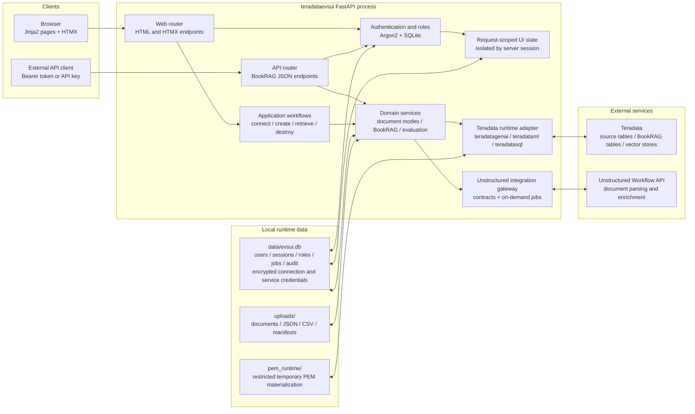
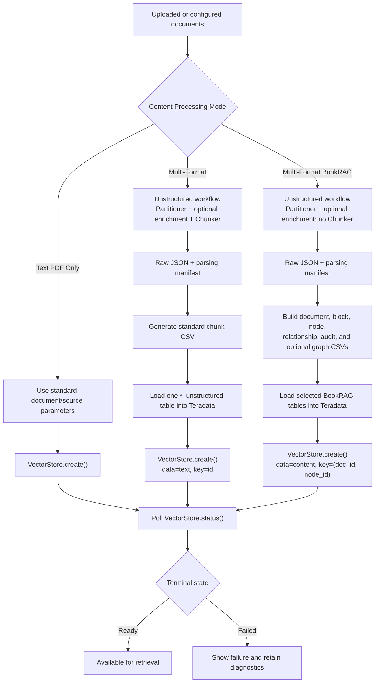
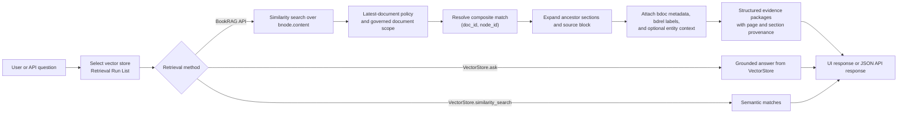
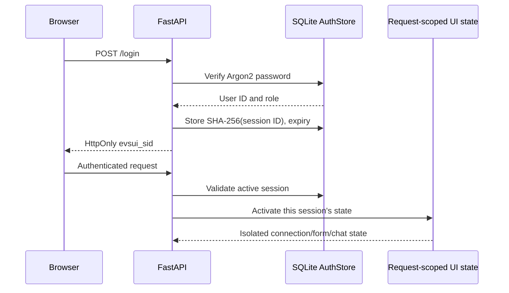

# teradataevsui — Teradata Vector Store UI

> **言語:** [English](README.md) | 日本語
<!-- Source-SHA256: 5df160e69139b4f536e84eee273e74c87f375d43775bbd59fa794565f7f369a1 -->

Teradata Vector Store は、Teradata データ上でベクトル検索・取得機能を提供します。ドキュメントのチャンクと埋め込みを管理対象の Vector Store として保存し、`VectorStore` と `VSManager` を通じて、作成、ヘルスチェック、一覧表示、削除、セマンティック類似検索、および根拠付き Q&A の操作を公開します。

teradataevsui は、Teradata Vector Store を操作するための `FastAPI + Jinja2 + HTMX` インターフェースです。再利用可能な Teradata 接続の選択、アップロードまたは構成済みソースからの Vector Store 作成、検索結果の検証、BookRAG ドキュメントメタデータのガバナンス、暗号化された共有サービス認証情報の管理を支援します。

## ライセンスと所有権

提案中の [Teradata Product-Restricted Source-Available License（英語）](LICENSE) には、
[日本語参考訳](LICENSE_ja.md) があります。英語の提案文は、対象となる
プロジェクト資料の所有権が Teradata にあることを宣言し、その使用、
変更、および再配布を、Teradata 製品に基づくか Teradata 製品とともに使用される
ソリューションに限定します。Teradata 以外の製品で単独使用または適応するには、
別途書面による許可が必要です。関連するサードパーティ依存関係にはそれぞれの
ライセンスが引き続き適用され、Teradata 製品には別途ライセンスとアクセス権が必要です。

これらは **Teradata による所有権の確認と承認を待つドラフト条項** であり、
既存の Teradata 公式ライセンスを主張するものではありません。これはソース公開型で
製品制限付きの提案であり、OSI 承認済みのオープンソースライセンスではありません。

## 目次

- [はじめに](#はじめに)
- [ライセンスと所有権](#ライセンスと所有権)
- [teradataevsui の使用](#teradataevsui-の使用)
- [全体設計](#全体設計)
- [機能概要](#概要)
- [実行時依存関係](#実行時依存関係)
- [Unstructured の構成](#unstructured-構成リファレンス)
- [BookRAG データ契約](#bookrag-データおよびリレーションシップ契約)
- [BookRAG API](#bookrag-api-に関する注意事項)
- [認証とローカル構成](#認証およびローカル構成リファレンス)
- [マルチユーザー管理](#マルチユーザー管理)
- [プロジェクト構造とルート](#プロジェクト構造)
- [初回インストール](docs/installation_ja.md)
- [アーキテクチャ](docs/architecture_ja.md)
- [運用](docs/operations_ja.md)
- [SQLite スキーマ](docs/database_schema_ja.md)

すべての公開ドキュメントは、英語の原文と完全な日本語版の組み合わせで保守されます。
各ドキュメント上部の言語切り替えを使用してください。CI は、翻訳の欠落、
構造上の不一致、または原文に対して古くなった翻訳を拒否します。

## はじめに

Windows PowerShell、Linux x86-64、ネイティブ本番起動、および Docker Compose を含む空のマシンからの完全な手順は、[初回インストールガイド](docs/installation_ja.md) を参照してください。以下は短縮したネイティブ開発手順です。

プロジェクト／パッケージ名は現在 `teradataevsui` です。サポート対象の CLI コマンドは
`teradataevsui-db` と `teradataevsui-ops` で、旧 `evsui-db` と `evsui-ops` は
互換性エイリアスとして残されています。
既存インストールの構成と暗号化データを維持するため、既存の `EVSUI_*` 環境変数、
`data/evsui.db`、その認証情報キー、およびセッション Cookie の名称は変更されません。
この名称変更に伴うデータベース移行や認証情報の再入力は不要です。
GitHub リポジトリは現在 `https://github.com/xuhaibintd/teradataevsui` です。
既存のチェックアウトでは、次のコマンドでリモートを更新してください。
`git remote set-url origin https://github.com/xuhaibintd/teradataevsui.git`
ローカルのプロジェクトディレクトリを移動または名称変更した後は、
`uv venv --clear --python 3.11 --no-python-downloads` を実行し、続けて適切な
ロック済み同期を実行してください。仮想環境のランチャーと editable
インストールには絶対パスが含まれる場合があります。`data/`、その認証情報キー、および `uploads/` はそのまま保持してください。

### 前提条件

teradataevsui をインストールする前に、次の項目を確認してください。

- Windows AMD64 または Linux x86-64。その他のオペレーティングシステムと CPU アーキテクチャは、
  ロックおよびテスト済みのサポート対象に含まれません。
- Python 3.11。ローカル開発、CI、および本番イメージで同じインタープリター系列を
  使用するため、サポート範囲を意図的に Python 3.11 に限定しています。
- ロック済み依存関係を厳密に同期するための [uv](https://docs.astral.sh/uv/getting-started/installation/) 0.12.10。
- リポジトリをクローンする場合は Git。
- Teradata システムへのネットワークアクセスと、次の Teradata 認証情報。
  - データベースのホスト、ユーザー名、およびパスワード。
  - 通常は `/open-analytics` で終わる UES URL。
  - PAT トークン。
  - 対象環境で必要な場合は PEM、キー、または証明書ファイル。
- `Multi-Format` または `Multi-Format BookRAG` を使用する場合に限り、Unstructured API URL と API キー。`Text PDF Only` は Unstructured を使用しません。

### 1. コードの取得

```bash
git clone https://github.com/xuhaibintd/teradataevsui.git
cd teradataevsui
```

すでにリポジトリがある場合は、そのルートディレクトリ（`pyproject.toml` と `uv.lock` があるディレクトリ）から残りのコマンドを実行してください。

### 2. ロック済み実行環境の同期

Windows PowerShell：

```powershell
uv sync --locked --no-dev
```

Linux x86-64：

```bash
uv sync --locked --no-dev
```

`uv` は必要に応じて `.venv` を作成し、厳密な同期を実行します。選択したロックファイルの
依存関係セットに含まれないパッケージはすべて削除されるため、メンテナンスを繰り返しても
孤立したパッケージが蓄積しません。

### 3. 最初の管理者の構成

teradataevsui はユーザーとサーバー側セッションを SQLite に保存します。データベースは `data/evsui.db` に自動作成されます。Python 組み込みの SQLite ドライバーを使用するため、別途データベースをインストールする必要はありません。新規インストールでは、アプリケーションを起動してブラウザーで開きます。ユーザーが存在しない場合は **Create administrator** が開き、初回 username、password、password confirmation の設定を求めます。管理者作成後、この一回限りの設定画面は閉じられます。

無人デプロイでは、初回起動前に環境変数から最初の管理者を作成できます。

Windows PowerShell：

```powershell
$env:EVSUI_BOOTSTRAP_ADMIN = "admin"
$env:EVSUI_BOOTSTRAP_PASSWORD = "replace-with-a-strong-password"
```

Linux x86-64：

```bash
export EVSUI_BOOTSTRAP_ADMIN=admin
export EVSUI_BOOTSTRAP_PASSWORD='replace-with-a-strong-password'
```

ブラウザー設定と環境変数設定は、どちらも 8 文字以上の password を要求します。password は Argon2 ハッシュとしてのみ保存されます。管理者が作成された後、初回設定画面とブートストラップ変数によって更新または上書きされることはありません。上部バーの **System Configuration** から、データベース接続プロファイルとアカウントを管理してください。

Teradata および Unstructured の任意のデフォルト値を設定するには、`app/config/local_dev.example.json` を `app/config/local_dev.json` にコピーします。login セクションは、旧インストールからの初回移行専用として残されています。代表的なローカル構成は次のとおりです。

```json
{
  "login": {
    "username": "",
    "password": "",
    "users": {}
  },
  "connection": {
    "host": "",
    "username": "",
    "password": "",
    "ues_url": "",
    "pat_token": "",
    "pem_file": ""
  },
  "unstructured": {
    "api_key": "",
    "api_url": "https://platform.unstructuredapp.io/api/v1"
  }
}
```

空の SQLite データベースでは、`app/config/local_dev.json`、`app/config/auth_users.json`、`POC_AUTH_FILE`、または旧 `POC_ADMIN_USER`／`POC_ADMIN_PASSWORD` 変数にある旧ユーザーが一度だけインポートされます。最初にインポートされたユーザーは `admin`、以降のユーザーは `operator` になります。対話型の新規インストールでは **Create administrator**、無人インストールでは `EVSUI_BOOTSTRAP_*` 変数を使用してください。

システム構成が存在しない場合、旧 `connection` 値はデフォルトのデータベース接続プロファイルとして一度だけインポートされます。インポートされた値を確認した後、JSON ファイルから削除してください。管理者は **System Configuration → Database Connections** で、プロファイルの作成、編集、削除、およびデフォルトの選択ができます。ホームページでは、ユーザーが接続前にこれらのプロファイルから 1 つを選択できます。マルチフォーマットモードを使用しない場合、`unstructured.api_key` は空のままで構いません。

`app/config/local_dev.json` は Git の追跡対象外です。実際のパスワード、PAT トークン、API キー、および証明書ファイルをバージョン管理に含めないでください。

`data/evsui.db` も意図的に追跡対象外です。環境固有のユーザー、暗号化された認証情報、セッション、および運用状態が含まれます。新規チェックアウトでは、バージョン管理されたマイグレーションから完全なスキーマが作成されます。データベースはソースコードではなく実行時データとしてバックアップおよびデプロイしてください。詳細は [運用](docs/operations_ja.md) を参照してください。

### 4. teradataevsui の起動

ターミナルで Web アプリケーションを起動します。

```bash
uv run --locked --no-sync python -m uvicorn app.main:app --reload --host 127.0.0.1 --port 8010
```

アプリケーションは、永続化されたバックグラウンドジョブを一度に 1 件、自動実行します。
ドキュメント解析、CSV 読み込み、および Vector Store 作成は SQLite にキュー登録され、
UI のポーリングを通じて表示されるため、ブラウザーリクエストが終了しても処理は継続します。
2 つ目のプロセスやコマンドは不要です。

<http://127.0.0.1:8010> を開き、前の手順で構成した認証情報でサインインします。`--reload` オプションはローカル開発用です。

Web プロセスが稼働していることを確認するには、次を実行します。

```bash
curl http://127.0.0.1:8010/healthz
```

Windows PowerShell では次を使用できます。

```powershell
Invoke-RestMethod http://127.0.0.1:8010/healthz
```

期待される応答は `{"status":"ok"}` です。このエンドポイントは teradataevsui プロセスのみを確認します。Teradata Vector Store へのアクセスを検証するには、接続後に **Refresh management data** を使用してください。

## teradataevsui の使用

### Teradata への接続

1. teradataevsui にサインインし、**Connect & Manage** を開きます。
2. 管理者は、環境で必要なデータベース、UES、および証明書の認証情報を含む再利用可能なプロファイルを、**System Configuration → Database Connections** で一度作成します。シークレットと PEM の内容は SQLite で暗号化されます。
3. 保存済みの **Database connection** プロファイルを選択します。ページには、シークレットを公開しない読み取り専用の概要が表示されます。
4. **Connect** を選択します。成功結果により、データベースコンテキストの作成と Vector Store 認証の両方が確認されます。
5. **Refresh management data** を選択して、Vector Store のヘルス状態、インストール済み `teradatagenai` のバージョン、互換性警告、および V1 Vector Store／V2 Collection の統合一覧を読み込みます。この更新は、接続後に自動実行されません。
6. リソースを絞り込むか選択して、詳細と利用可能な操作を確認します。管理者は、アクティブな EVS セッションを読み込み、選択したユーザーのアクティブな EVS セッションをすべて切断することもできます。

### Vector Store の作成

1. **Vector Store Creation** を開き、1 つ以上のドキュメントをアップロードします。
2. **Content Processing Mode** を選択します。
   - **Text PDF Only** は、構成済み PDF／ドキュメントソースを標準の `VectorStore.create()` フローに渡します。
   - **Multi-Format** は Unstructured を使用して標準チャンクテーブルを生成し、そのテーブルから Vector Store を作成します。
   - **Multi-Format BookRAG** は Unstructured を使用し、ベクトル作成前にドキュメントスコープの BookRAG テーブルを構築します。
3. Vector Store 名、埋め込みモデル、検索アルゴリズム、およびモード固有の設定を指定します。
4. いずれのマルチフォーマットモードでも、表示される 3 段階を **Document Parsing**、**Generate CSV from JSON**、**Load CSV to Unstructured Table** または **Load CSV to Tables** の順に完了します。続いて、Vector Store 名フィールドに表示されるテーブル準備済みの実行を選択します。
5. **Create Vector Store** を選択し、バックグラウンドジョブが `Ready` または `Failed` を報告するまで待ちます。デフォルトの準備完了タイムアウトは 2 時間で、`EVS_VECTORSTORE_READY_TIMEOUT_SECONDS` で変更できます。

アップロードファイルを使用する `Text PDF Only` フローでは、UI は `object_names` を自動入力しません。Teradata Vector Store 構成で必要なソースフィールドを指定してください。

### 検索結果の取得と確認

1. **Vector Store Retrieval** を開きます。
2. **Run List** を選択して検索専用リストを更新し、Vector Store を選択します。管理用リストと検索用リストは独立して更新されます。
3. `VectorStore.ask`、`VectorStore.similarity_search`、または **BookRAG API** を選択し、質問を入力して **Send** を選択します。
4. 共有の暗号化された Teradata および Unstructured 認証情報は、**System Configuration** で管理します。BookRAG Store については、**BookRAG Governance** でドキュメントメタデータとリレーションシップを管理します。

### よくある起動時の問題

- **Create administrator が繰り返し表示される**：ユーザーテーブルはまだ空です。一回限りのフォームを完了するか、無人設定では再起動前に `EVSUI_BOOTSTRAP_ADMIN` と `EVSUI_BOOTSTRAP_PASSWORD` の両方を設定してください。
- **`uv` is not available**：`uv --version` を実行し、起動コマンドを使用する前に `uv` をインストールするか `PATH` を修正してください。記載されている `uv run` の手順では、仮想環境を手動で有効化する必要はありません。
- **Unstructured API key missing**：管理者が **System Configuration → Unstructured IO** で共有エンドポイントと API キーを保存する必要があります。
- **Teradata connection fails**：管理者に、選択した保存済みプロファイルの Host、Username、Password、UES URL、PAT Token、および必要な PEM／証明書データを確認してもらい、そのプロファイルで再接続してください。
- **A vector store does not appear in Retrieval**：Retrieval ページで **Run List** を選択してください。Connect & Manage のリストによって更新されることはありません。

## 全体設計

teradataevsui は、1 つの FastAPI プロセスで動作するサーバーレンダリング Web アプリケーションです。Jinja2 が完全なページをレンダリングし、HTMX が対話的操作のためにページフラグメントを置換します。Web ルートと JSON API ルートは同じドメインサービスを共有し、統合モジュールが Teradata および Unstructured の呼び出しを UI コードから分離します。

### コンポーネントアーキテクチャ



主要なコード境界は次のとおりです。

| レイヤー | 主な場所 | 責務 |
|---|---|---|
| アプリケーションエントリ | `app/main.py`, `app/core/` | アプリファクトリ、型付き設定、セキュリティヘッダー、エラー処理、および Teradata ランタイム分離 |
| Web 配信 | `app/routers/web.py`, `app/routers/auth.py`, `app/routers/system_admin.py`, `app/templates/`, `app/static/` | ログイン、システム構成、HTML/HTMX エンドポイント、フォーム、およびブラウザー動作 |
| JSON API | `app/routers/api.py` | BookRAG スキーマ、検索、回答、およびヘルスエンドポイント |
| ワークフローオーケストレーション | `app/workflows/` | 作成、チャット、および破棄操作の調整 |
| ドメインサービス | `app/services/` | ドキュメント処理、マニフェスト、BookRAG スキーマ／ツリー／検索、および SQL ヘルパー |
| ドキュメントモードプラグイン | `app/services/doc_modes/` | 1 つのハンドラーレジストリを通じて `Text PDF Only`、`Multi-Format`、または `Multi-Format BookRAG` の動作を選択 |
| ランタイム統合 | `app/teradata_runtime.py`, `app/services/unstructured_runtime.py` | 外部 SDK の読み込みと統合構成の解決 |
| Unstructured 境界 | `app/integrations/unstructured/` | ワークフロー契約を検証し、ジョブの送信、ポーリング、診断、およびダウンロードを行う単一の安定したゲートウェイを公開 |
| 永続化 | `app/repositories/`, `app/db/` | SQLite リポジトリ、番号付きマイグレーション、暗号化された外部サービス構成、ジョブ、アーティファクト、およびオンラインバックアップ |
| 認証 | `app/auth_store.py` | Argon2 パスワード、ログインロックアウト、ロール、サーバーセッション、旧データ移行ファサード、および監査レコード |
| セッション状態 | `app/session_state.py` | コンテキストローカル状態を使用し、同時リクエスト間でユーザーの接続、フォーム、アップロード、またはチャット状態が入れ替わらないようにする |

### Vector Store 作成パス

すべての作成モードは `VectorStore.create()` に合流しますが、ソースの準備方法が異なります。



どちらのマルチフォーマットモードでも、解析、JSON から CSV への変換、および Teradata への読み込みは意図的に別々の段階です。各段階は、パス、チェックサム、行数、およびステータスを含むマニフェストを書き込みます。後続段階は検証済みの `ready` マニフェストのみを受け付けるため、変換または読み込みだけを再試行する場合に Unstructured 呼び出しを繰り返す必要はありません。

### 検索パス

標準の検索は、選択した Vector Store を直接呼び出します。BookRAG は、管理されたドキュメントスコープを追加し、各セマンティック一致の周囲に追跡可能なエビデンスパッケージを再構築します。



BookRAG テーブルの詳細なリレーションシップと変換ルールは、[BookRAG パイプライン：データ構造と処理フロー](docs/bookrag_pipeline_diagram_ja.md) に記載されています。外部 SQL の結合契約は、テーブル名から推測せず、常に `GET /api/bookrag/schema` から取得してください。

### 状態と永続化モデル

- ユーザー、ロール、パスワードハッシュ、再利用可能なデータベース接続プロファイル、共有 Unstructured 構成、サーバー側セッション、ジョブ、アーティファクトレコード、および監査レコードは `data/evsui.db` に永続化されます。データベースパスワード、PAT トークン、PEM の内容、および外部 API キーは、書き込まれる前に暗号化されます。SDK がファイルシステムパスを必要とする場合に限り、制限付きランタイムファイルとして PEM が実体化されます。Teradata がそのファイル名から JWT の `kid` を導出するため、元のファイル名が使用されます。
- 接続状態、アップロード選択、およびチャット履歴は、`evsui_sid` ごとにプロセスローカルのままです。これらはリクエストスコープで同時ユーザーに対して安全ですが、プロセスを再起動すると一時的な UI 状態はリセットされます。共有システム接続はログイン時と接続前に SQLite から読み込まれます。
- セッション Cookie にはランダムな不透明 ID のみが含まれます。サーバーはその SHA-256 ハッシュだけを保存し、デフォルトで 8 時間の有効期限を適用し、ログアウト、パスワードリセット、またはユーザー無効化時にセッションを失効させます。
- アップロード済みドキュメント、生 JSON、生成 CSV ファイル、およびマニフェストは `uploads/` 以下に保存されます。暗号化された PEM の内容は SQLite に保存され、制限付きの一時実体化ファイルは `pem_runtime/` 以下に置かれます。
- Vector Store、標準マルチフォーマットソーステーブル、および BookRAG テーブルは Teradata に永続化されます。
- `data/`、`uploads/`、`pem_runtime/`、`.env`、ローカル構成、および旧認証ユーザーファイルは追跡対象外の実行時データであり、コミットしてはいけません。
- UI は設計上、管理用リストと検索用リストを独立して更新します。一方のパネルで選択または削除しても、もう一方のパネルの現在のリストは暗黙に変更されません。

## 概要

### Connect & Manage

- データベース接続と認証：
  - `create_context(host, username, password)`
  - `set_auth_token(base_url, pat_token, pem_file)`
- 管理操作：
  - `VSManager.health()`
  - `VSManager.list()`
  - 選択して `VectorStore.destroy()` を実行

### Vector Store Creation

- 複数ファイルのアップロードに対応
- 完全な `VectorStore.create(...)` パラメータフォーム
- `VECTORDISTANCE / KMEANS / HNSW` 用の組み込みパラメータセット
- `Multi Format` モードは、Unstructured Workflow Endpoint のオンデマンドジョブと、共有の生 JSON、標準 Unstructured CSV、`<Vector Store Name>_unstructured` テーブルへの読み込みという再利用可能な 3 段階フローを使用します。BookRAG と Multi Format は同じ生 JSON 実行を検出し、JSON から CSV への変換とテーブル読み込みの段階でのみ分岐します。標準 Multi-Format の JSON から行へのマッピングとテーブル契約は変更されません。
- `Multi-Format BookRAG` モードは、インライン `job_nodes` を伴う Unstructured Workflow Endpoint のオンデマンドジョブを使用し、ドキュメントスコープの Teradata テーブルを構築します。また、必要に応じて `bnode.content` から `(doc_id, node_id)` をベクトルキーとして `VectorStore.create()` を実行できます。視覚的なパイプラインとテーブルモデルについては、[BookRAG パイプライン：データ構造と処理フロー](docs/bookrag_pipeline_diagram_ja.md) を参照してください。
- BookRAG は、検索された箇所にセクションパス、ページ、ソースブロック、および任意のテーブル／画像／エンティティコンテキストが必要となる、長く構造化されたドキュメントを対象としています。レビュー用に追跡可能なエビデンス候補を提供しますが、それ自体でグラフ探索、ドキュメント間エンティティ解決、矛盾検出、引用検証を行うものではありません。産業ユースケースの判断ガイドは、[英語](docs/bookrag_industrial_use_cases.md) または [日本語](docs/bookrag_industrial_use_cases_ja.md) を参照してください。

### Vector Store Retrieval

- `VectorStore.ask` と `VectorStore.similarity_search` に対応
- チャット対象の Vector Store 用に独立した Run List ドロップダウンを提供
- BookRAG の検索は、`bnode.content` に対するセマンティック類似性を使用します。明示的な時間軸を含まない質問では、API が最初に管理対象のドキュメントスコープを解決し、その範囲外のセマンティック一致を破棄します。保持された各ノードは、祖先セクションチェーン、ソースブロック、ドキュメントメタデータ、管理対象のドキュメントリレーションシップラベル、および利用可能な場合はノードローカルのエンティティ／リレーションメタデータで展開されます。
- 最新ドキュメントのガバナンスは `bdoc` に発行メタデータを追加し、廃止された `bdrel.updates` の対象を除外し、API と MCP SQL の両方から使用する 1 つの `<vector_store>_bk_retrieval_v` ビューを公開します。[BookRAG 最新ドキュメントガバナンス](docs/bookrag_latest_document_governance_ja.md) を参照してください。
- 関連ドキュメント行とエンティティリレーションは、一致済みエビデンスパッケージを拡充するものであり、追加の検索エッジではありません。現在のサービスは、関連ドキュメントの自動取得、エンティティグラフの探索、関連するすべてのセクションの比較、または生成された回答の主張が返された引用候補によって裏付けられているかの検証を自動では行いません。

### BookRAG の商用アプリケーションシナリオ

BookRAG は、汎用ドキュメントチャットボットではなく、高価値なドキュメント業務のためのエビデンス検索・レビューレイヤーとして位置付けるべきです。商用購入者は、専門家が長いドキュメントからエビデンスを探し、確認し、説明することに多くの時間を費やし、なおかつ成果物に人の承認を必要とするチームです。

#### 主要な市場参入先：定期開示および財務報告書レビュー

最も有力な初期商用シナリオは、繰り返し発行される企業開示資料を対象とした調査です。想定される購入者と利用者には、銀行・証券の調査チーム、資産運用会社、企業の IR チーム、信用リスクチーム、および内部監査が含まれます。

実用的なワークフローは次のとおりです。

1. 年次報告書、四半期決算、プレゼンテーション資料、訂正資料、および関連号を、それぞれ独立した安定ドキュメントとして読み込みます。
2. `next_issue_of`、`updates`、`summary_of`、`supplement_to` などの管理対象リレーションシップを記録します。
3. 関連する開示資料を、そのセクションパス、ページ範囲、ソースブロック、テーブル HTML、および利用可能なエンティティコンテキストとともに取得します。
4. アナリストまたは外部アプリケーションが複数のエビデンスパッケージをレビューし、ブリーフィング、差異メモ、または調査メモを作成します。
5. 出力とともにドキュメントおよびソースの位置情報を保持し、別のレビュアーが元のエビデンスに戻れるようにします。

これは、次のような問いに商用上有用です。

- 経営陣は重要 KPI の変化をどこで説明しており、その説明を裏付けるテーブルまたは注記は何か。
- 最新の報告期間について、アナリストが確認すべきリスク、見通し、または会計方針の開示は何か。
- 現在のどのドキュメントが、以前の開示資料の更新、補足、または要約に当たるか。
- 期間比較または投資委員会のレビュー前に、どのエビデンスを収集すべきか。

現在の実装は、これらのワークフローにエビデンスパッケージを提供できます。期間比較の計算、自動変更検出、矛盾分析、および投資判断は、現在の検索サービス外にある、レビュー済みのアプリケーションロジックで実行する必要があります。

商用上の成功は、回答の流暢さだけでなく、エビデンス発見までの時間短縮、アナリストによるエビデンス採用率、ページ／セクション位置の正確性、重要エビデンスの見落とし率、およびアナリストの処理量によって評価すべきです。

#### その他の商用シナリオ

| シナリオ | 購入者と業務 | BookRAG の成果物 | ビジネス価値 | 必要となる人またはアプリケーションの手順 |
|---|---|---|---|---|
| ポリシーおよび統制のレビュー | コンプライアンス、リスク、および内部監査チームが、ポリシーや統制マニュアル内の要件、例外、担当者、およびエビデンスを特定 | 一致テキスト、条項階層、ページ、ソース要素、および関連ドキュメントラベルを含むレビューパケット | 統制レビューの短縮と、より再現可能なエビデンス収集 | レビュアーが適用可能性と遵守状況を判断する。BookRAG はコンプライアンス判定を行わない |
| 契約および調達レビュー | 法務、調達、ベンダー管理チームが、定義、義務、更新条件、違約金、および別紙を確認 | セクションとドキュメントの出所を伴う条項レベルのエビデンスパッケージ | 条件の特定と論点リスト作成にかかる時間を短縮 | 法務担当者が解釈を検証する。契約間比較には複数回の検索をまたぐオーケストレーションが必要 |
| 技術サービスおよび保守支援 | フィールドサービス、製造、サポートチームが、マニュアル、サービス速報、トラブルシューティングガイド、および改訂手順を検索 | マニュアル階層、ページ、テーブル／画像コンテキスト、および更新／補足リレーションシップを伴う関連手順または警告 | 診断の迅速化、誤った手順選択の削減、一貫したエスカレーション | 製品／バージョンのフィルタリングと安全承認は、ホストアプリケーションおよび運用プロセスの一部として残る |
| 規制対象の研究および品質レビュー | 製薬、医療機器、研究所、および品質チームが、SOP、仕様書、研究報告書、および逸脱記録を確認 | レビュー記録または調査パッケージ向けの追跡可能なソースエビデンス | エビデンス準備の迅速化と、別の担当者によるレビューの容易化 | 有資格者が科学、臨床、品質、および出荷の判断を行う |
| デューデリジェンス・データルームのトリアージ | M&A、信用、保険、および第三者リスクチームが、報告書、ポリシー、契約、および補足ファイルをスクリーニング | ドキュメントスコープのエビデンスパッケージと専門家レビュー用項目キュー | 初期トリアージの迅速化と、専門分野の担当者への明確な引き継ぎ | 完全性チェック、ドキュメント間の照合、およびリスク判断には追加のワークフローロジックが必要 |

#### 商用適格性ルール

次の条件をすべて満たす場合に BookRAG を選択してください。

- ソースセットに、長いまたは構造的に複雑なドキュメントが含まれている。
- レビュアーが回答からセクション、ページ、テーブル、画像コンテキスト、またはソース要素へ戻る必要がある。
- 誤った回答またはコンテキストのない回答によって、無視できないレビューコストが生じる。
- ワークフローに、構造化されたエビデンスパッケージを使用できる人間のレビュアーまたはアプリケーションレイヤーが存在する。
- 検索およびレビュー時間の予想短縮効果が、追加の解析、ストレージ、および評価コストに見合う。

短いまたはフラットなコンテンツ、FAQ と基本的なサポート検索、低リスクのセマンティック検索、または通常のチャンクで測定済みの検索目標を満たせるワークロードには、代わりに `Multi Format` を使用してください。

現在の実装を、自律型ナレッジグラフ、自動監査人、法務または臨床の意思決定者、あるいはエンドツーエンドのデューデリジェンスエンジンとして販売しないでください。エンティティ正規化はドキュメントスコープです。ドキュメントリレーションシップは、すでに一致したドキュメントにコンテキストを追加しますが、探索エッジではありません。回答の引用は検証済みの主張・ソース間リンクではなく、エビデンス候補です。ドキュメント間の展開、比較、矛盾検出、計算、ワークフロー承認、および最終回答の検証には、追加のアプリケーションロジックが必要です。

セクション構築では、利用可能な場合は Unstructured の構造メタデータを使用し、日本語向けのローカルフォールバックプロファイルを併用します。本番利用前に、各顧客の代表的なコーパスで、見出し再構築、テーブル保持、検索再現率、およびソース位置の正確性を評価してください。

### システム構成と管理ルール

- **Database Connections** は、ユーザーが接続前に選択する再利用可能な Teradata プロファイルを管理します。
- **Unstructured IO** は、Multi Format および Multi-Format BookRAG 用の共有 API エンドポイントと暗号化 API キーを 1 つ保存します。
- **User Management** はアカウントとロールを管理します。ホームページの **BookRAG Governance** は別機能であり、コーパスメタデータ、ドキュメントリレーションシップ、および JSON 検査を管理します。

## 現在の動作

- Connect & Manage は 1 つの **Refresh management data** 操作で、接続状態、Vector Store のヘルス状態、`teradatagenai` の実行時バージョン、互換性警告、および V1 Vector Store／V2 Collection の統合一覧を読み込みます。
- 管理対象リソースを選択すると、その識別情報、構成、状態、ファイル取り込み情報、権限、およびサインイン中のロールに許可された操作が読み込まれます。
- 管理データの更新と Vector Store Retrieval の `Run List` は独立しています。管理対象リソースを更新または削除しても、検索用ドロップダウンは暗黙に変更されません。
- 接続時に管理データは自動読み込みされません。明示的な更新により、リモート SDK 呼び出しをユーザーが制御できます。
- 管理者はアクティブな EVS 接続セッションを確認し、他のユーザーに影響を与えず、選択したユーザーのアクティブな EVS セッションをすべて切断できます。
- Vector Store Retrieval で `Run List` をクリックすると、実際の Vector Store が読み込まれ、デフォルトで利用可能な項目が表示されます。
- `vector_store_name`、`doc_pipeline_mode`、`embeddings_model`、およびドキュメントソースが存在しない場合、Vector Store Creation の送信検証によって作成がブロックされます。アップロード済みファイルと `document_files` は、どちらもこのチェックを満たします。
- アップロードファイルを使用する作成フローでは、UI は `object_names` を自動入力しません。
- `VectorStore.create()` が単に戻っただけでは、Vector Store Creation は成功を報告しません。バックグラウンドジョブランナーは、`VectorStore.status()` が `Ready` または `Failed` になるまで、デフォルトで 5 秒ごと（`EVS_VECTORSTORE_READY_POLL_SECONDS`）にポーリングし、デフォルトのタイムアウトは 2 時間（`EVS_VECTORSTORE_READY_TIMEOUT_SECONDS`）です。タイムアウトは永続ジョブを失敗状態にし、診断情報を記録しますが、リモートサービスがすでに受け付けた処理をキャンセルすることはできません。オペレーターは再試行前にリモートステータスを確認してください。
- 読み込み済み BookRAG Store が `Ready` になると、アプリはベクトルインデックスの行数が空でない `bnode.content` の行数と一致することを検証します。`EVS_BOOKRAG_INDEX_READY_TIMEOUT_SECONDS` を使用すると、データベースへの反映待機時間を任意で追加できます。デフォルトは即時検証 1 回です。利用できない検証クエリは警告となりますが、正常に検証された空または不完全なインデックスはエラーです。
- `create()` が `already exists` を報告した場合、アプリはフィルターなしの `VSManager.list()` で存在を検証し、現在のステータスが `Ready` の場合にのみ Store を再利用します。

## 実行時依存関係

`pyproject.toml` は直接依存関係を宣言する唯一のファイルであり、`uv.lock` は
完全な推移的依存関係グラフを固定します。実行時依存関係だけをインストールするには、
`uv sync --locked --no-dev` を使用します。直接の実行時依存関係は次のとおりです。

- Web アプリケーション：`fastapi`、`standard` extra を付けない `uvicorn`、`starlette`、`pydantic`、`jinja2`、
  および `python-multipart`。
- Teradata 統合：`teradatagenai` と `teradataml`。必須の `teradatasql` および
  `teradatasqlalchemy` ドライバーは、重複する直接宣言ではなく、`teradataml` の
  ロック済み推移的依存関係として保持されます。
- ドキュメント処理：`unstructured-client` と `pypdf`。スプレッドシート入力は、
  ホスト型 Unstructured ワークフローで処理され、独立したローカル Excel エンジンはありません。
- 認証と認証情報の暗号化：`argon2-cffi` と `cryptography`。SQLite は Python 標準ライブラリによって提供されます。

Ruff は開発グループに分離されています。Playwright は明示的な `browser`
extra であり、通常の開発同期または本番同期ではインストールされません。
アプリケーションは、重量級のローカル `unstructured`、機械学習、Notebook、
LangChain、OpenAI、または Google/Vertex AI スタックに依存しません。

依存関係を意図的にアップグレードする場合は、ロックを更新し、完全なテスト環境を
厳密に同期し、受け入れスイートを実行してから、両方のメタデータファイルをコミットします。

```powershell
uv lock --upgrade
uv sync --locked --extra browser
uv run --locked --no-sync playwright install chromium
uv pip check
uv sync --locked --extra browser --check
uv run --locked --no-sync python scripts/check_dependencies.py
uv run --locked --no-sync python scripts/check_publication.py
uv run --locked --no-sync ruff check app tests scripts
uv run --locked --no-sync python -m compileall -q app scripts
uv run --locked --no-sync python -m unittest discover -s tests -q
$env:EVSUI_BROWSER_TESTS = "1"
uv run --locked --no-sync python -m unittest tests.test_browser_actions tests.test_frontend_parameters -v
uv build --clear
uv run --locked --no-sync python scripts/verify_wheel.py
uv sync --locked --no-dev --no-install-project
uv pip check
uv sync --locked --no-dev --no-install-project --check
uv sync --locked --extra browser
```

対象を限定してアップグレードするには `uv lock --upgrade-package <name>` を使用します。場当たり的な
`pip install` でパッケージを追加しないでください。意図する依存関係を `pyproject.toml` に追加または
削除し、`uv.lock` を再生成し、厳密な同期によって古いパッケージを削除します。

Node.js のビルド手順も TypeScript の依存関係もありません。テンプレート、HTMX 2.x の動作、ネイティブ JavaScript ES Modules、および CSS は FastAPI から直接配信されます。`uploads/` 以下の実行時アップロード／ステージングディレクトリは自動作成され、Git の追跡対象外です。

## Unstructured チェーンガイド

このプロジェクトは、Unstructured の現在のホスト型 API ガイダンスに従います。

- 本番ワークフローには **Workflow Endpoint / on-demand jobs** を使用します。
- **Partition Endpoint** は **legacy / prototyping only** として扱います。
- 同じ機能設計内で Workflow と Partition の前提を混在させないでください。

公式リファレンス：
- Workflow ドキュメント：https://docs.unstructured.io/api-reference/workflow/workflows
- Workflow 利用可能モデル：https://docs.unstructured.io/api-reference/workflow/models
- Workflow UI ガイド：https://docs.unstructured.io/ui/workflows
- Partition Endpoint 概要：https://docs.unstructured.io/platform-api/partition-api/overview
- Partition Endpoint パラメータ：https://docs.unstructured.io/api-reference/partition/api-parameters
- パーティショニング戦略ガイド：https://docs.unstructured.io/ui/partitioning

### 公式 API の選択

1. **Workflow Endpoint**
- 本番レベルの使用に公式推奨されています。
- バッチ、最新モデル、エンリッチメント、チャンキング戦略、埋め込み、およびリモートソースに対応します。
- 概念的なチェーン：`Source -> Partitioner -> optional Enrichment -> optional Chunker -> optional Embedder -> Destination`

2. **Partition Endpoint**
- 公式に legacy / rapid prototyping と位置付けられています。
- ローカルファイルを一度に 1 つ処理する用途を意図し、チャンキング機能は限定的です。
- 概念的なチェーン：`Local file -> Partitioner(strategy=...) -> optional chunking_strategy`

### 公式の呼び出しパス

1. **Partition Endpoint (legacy)**
- 典型的な呼び出し形式：`POST https://api.unstructuredapp.io/general/v0/general`
- 典型的なリクエスト形式：`files` と、`strategy` や `output_format` などのパーティションパラメータを含む multipart フォーム
- 公式の位置付け：legacy、ローカルファイル専用、一度に 1 ファイル、限定的なチャンキング、迅速なプロトタイピング向け

2. **Workflow on-demand job**
- 典型的な呼び出し形式：`POST https://platform.unstructuredapp.io/api/v1/jobs/`
- 典型的なリクエスト形式：`request_data` と `input_files` を含む multipart フォーム
- `request_data` はインライン `job_nodes` を使用する一時ワークフローを定義するか、テンプレートを参照できます。
- 公式の位置付け：ローカルファイルのジョブ実行に推奨される Workflow Operations パス。ワークフローはそのジョブ実行中にのみ存在します。

3. **Long-lived workflow + run**
- 再利用可能なワークフローを定義：`POST https://platform.unstructuredapp.io/api/v1/workflows`
- 再利用可能なワークフローを実行：`POST https://platform.unstructuredapp.io/api/v1/workflows/{workflow_id}/run`
- 典型的なリクエスト形式：永続的な `workflow_nodes` を一度定義し、実行時に `input_files` を送信
- 公式の位置付け：`workflow_id` で一覧表示、更新、および再利用できる名前付きワークフローリソースが必要な場合に使用

### 現在の teradataevsui のマッピング

1. **Unstructured** (`doc_pipeline_mode=multi_format`)
- **Workflow Endpoint** を使用します。
- 現在の転送パス：`local file -> POST /jobs -> inline job_nodes`
- 統合ゲートウェイはネットワーク I/O 前に DAG を検証し、SDK／REST の変更を BookRAG オーケストレーションから分離します。
- 失敗したジョブには、サービスから公開される場合に、ベストエフォートの処理詳細と失敗ファイル診断が含まれます。
- 実装済みチェーン：`Partitioner -> optional Enrichment nodes -> Chunker`
- teradataevsui における現在のワークフローチャンカーオプション：
  - `chunk_by_character`
  - `chunk_by_title`
  - `chunk_by_page`
  - `chunk_by_similarity`
- UI は処理を **Document Parsing**、**Generate CSV from JSON**、および **Load CSV to Unstructured Table** に分割します。その JSON 実行セレクターは、いずれかの生ステージディレクトリにある旧実行を含め、BookRAG と同じ準備済み解析マニフェストを共有します。CSV 段階では既存の `UNSTRUCTURED_CHUNK_COLUMNS` マッピングのみを適用し、BookRAG ノード、グラフ、または補助テーブルを構築しません。
- 読み込みと行数検証後、テーブル準備済みの実行を Basic で選択し、`text` をデータ列、`id` をキー列として `VectorStore.create()` で使用できます。

2. **Unstructured BookRAG** (`doc_pipeline_mode=multi_format_bookrag`)
- **Workflow Endpoint** を使用します。
- 現在の転送パス：`local file -> POST /jobs -> inline job_nodes`
- 現在の実装済みチェーン：`Partitioner -> optional Enrichment nodes`
- 明示的な VLM パーティショニングでは、送信前に冗長な画像説明、テーブル説明、table-to-HTML、および生成 OCR ノードを省略します。
- 現在のアプリ動作は、生のワークフロー出力と派生したドキュメント／ブロック／ノード構造を Teradata BookRAG テーブルに保存します。
- 視覚的アーキテクチャリファレンス：[BookRAG パイプライン：データ構造と処理フロー](docs/bookrag_pipeline_diagram_ja.md)
- 現在のアプリ動作は、インライン `job_nodes` を伴うオンデマンドジョブを送信します。現在、名前付き Workflow の作成／再利用は行わず、`workflow_id` でも実行しません。
- 現在の BookRAG フローは、Workflow の `Chunker` ノードを追加しません。
- コードが実際に Workflow チャンクノードを追加していない限り、現在の BookRAG 実装を `by_title` チャンキングと説明しないでください。

### Workflow Endpoint の公式ルート組み合わせ

1. **Fast**
- 公式用途：テキストのみのドキュメント。
- 推奨チェーン：`Partitioner(Fast) -> Chunker`
- ここでは、画像説明、テーブル説明、table-to-HTML、または生成 OCR の出力を期待しないでください。

2. **Auto**
- 公式推奨：ほとんどの場合に使用。
- 推奨チェーン：`Partitioner(Auto) -> optional Enrichment nodes -> Chunker`
- PDF の場合、Auto はページごとにルーティングできます。単純な埋め込みテキストのページは Fast、より複雑なページは High Res または VLM に送られる場合があります。

3. **High Res**
- 公式用途：より強力な構造処理、単純なテーブル、画像、またはバウンディングボックス座標を必要とする、サポート対象ファイル形式。
- 推奨チェーン：`Partitioner(High Res) -> optional Enrichment nodes -> Chunker`

4. **VLM**
- 公式用途：視覚的に複雑な PDF／画像、特に複雑なテーブル、画像、多言語、スキャン、または手書きコンテンツの最高品質処理。
- 推奨チェーン：`Partitioner(VLM) -> Chunker`
- VLM ワークフローでは、個別の画像説明、テーブル説明、table-to-HTML、および生成 OCR ノードは、公式ワークフローガイダンスにより **不要（または許可されていません）**。

### 公式のルート選択ガイダンス

- **Auto**：ほとんどの場合に推奨されます。
- **Fast**：ファイルがテキストのみで、テーブル、画像、多言語、スキャン、または手書きコンテンツを含まないことが確実な場合にのみ使用します。
- **High Res**：少なくとも 1 つのファイルに画像または単純なテーブルがあり、より強力なレイアウト処理または座標が必要なことが確実な場合に使用します。
- **VLM**：ファイルに複雑なテーブル、画像、多言語テキスト、スキャンページ、または手書きが含まれる場合に最適です。

### 公式エンリッチメントルール

- `Fast + enrichment nodes`：エンリッチメント出力を期待しないでください。
- `Auto/High Res + enrichment nodes`：ファイル内容とルーティングされたパーティションパスが対象となる場合にサポートされます。
- `VLM + separate image/table/OCR enrichment nodes`：追加しないでください。VLM がそれらの出力を提供します。NER は引き続き使用できます。
- model-backed の画像／テーブル説明、table-to-HTML、生成 OCR、NER ノードは、選択した `provider_type` と `model` を送信します。`twopass_image_description` と `twopass_table2html` は platform-managed model のため、両方を送信しません。
- on-demand job は一リクエストにつき一ファイルを送信し、10 MB を超えるファイルは network I/O 前に拒否します。

### 現在の teradataevsui のデフォルト値

これらは **アプリケーションのデフォルト値** であり、Unstructured の公式デフォルト値ではありません。

- `multi_format_strategy = auto`
- `multi_format_chunk_strategy = chunk_by_character`
- `multi_format_chunk_size = 600`
- `multi_format_chunk_overlap = 80`
- `multi_format_chunk_new_after_n_chars = 600`
- `multi_format_chunk_combine_text_under_n_chars = 600`
- `multi_format_chunk_multipage_sections = true`
- `multi_format_chunk_similarity_threshold = 0.5`
- `multi_format_infer_table_structure = false`
- UI では、すべての Unstructured エンリッチメントのデフォルト値は `false`

### このリポジトリのコーディングルール

- `multi_format` を更新するときは、**Workflow Endpoint** の観点のみで考えてください。
- `chunking_strategy=basic` など、Partition Endpoint 専用の概念を現在の `multi_format` ワークフローパスへ再導入しないでください。
- ドキュメント、UI ラベル、またはテストで `by_title`、`basic`、その他のチャンクラベルに言及する場合は、コード内の実際のチェーンと一致させてください。
- Unstructured 統合を文書化するときは、API エントリーポイントと DAG ノードタイプを区別してください。`Partitioner` ノードで始まる Workflow であっても、旧 Partition Endpoint ではありません。
- コードが実際に Workflow リソースを作成／再利用し、`workflow_id` または `/workflows/{workflow_id}/run` でジョブを実行していない限り、現在の BookRAG 実行を再利用可能な名前付き Workflow と説明しないでください。
- BookRAG が今後、実際の Workflow `Chunker` ノードを追加する場合は、同じ変更内でこの README とテストを更新してください。

## BookRAG データおよびリレーションシップ契約

このセクションは、現在の BookRAG 実装の規範的な説明です。開発者と外部 LLM／MCP クライアントの両方を対象としています。最終更新：**2026-07-14**。

### 正規ルール

- `doc_id` は、アップロードされた 1 つのドキュメントインスタンスの安定した識別子です。アップロード時に新しい UUID が割り当てられ、そのアップロードマニフェスト、JSON／CSV ステージング、Teradata テーブル、ベクトルキー、検索、およびドキュメントリレーションシップを通じて保持されます。同じファイルを再度アップロードすると、新しい `doc_id` が作成されます。識別子はファイル名またはファイル内容から導出されません。
- 1 つのドキュメント内でのみ一意となるすべての識別子は、`doc_id` と組み合わせて結合する必要があります。`node_id`、`element_id`、`entity_id`、`link_id`、または `relation_id` を単独で結合しないでください。
- アクティブなベクトルソースは物理 `bnode` テーブルです。データ列は `content`、キー列は `(doc_id, node_id)` です。
- `bleaf` は旧機能／クリーンアップ専用のビュー対象であり、現在のベクトルソースではありません。これに依存する新しいクエリを作成しないでください。
- `bchk` は互換性／ヘルパーテーブル対象として残っていますが、現在の Multi-Format BookRAG パイプラインはこれを生成も照会もしません。
- 物理テーブル名は `build_bookrag_table_targets()` によって生成されます。Teradata の 30 文字の識別子制限により、長い Vector Store 名が短縮／ハッシュ化される場合があるため、クライアントは文字列連結で名前を構築してはいけません。実際の名前は `GET /api/bookrag/schema?vector_store_name=...` から取得してください。

### アクティブテーブル

| サフィックス | 契約キー | ロール | 主キー | 目的 |
|---|---|---|---|---|
| `bdoc` | `documents` | Core | `doc_id` | ドキュメントカタログ、元のファイル名、ソース／デバッグ JSON パス、ワークフロー／ジョブメタデータ、ファイルプロパティ |
| `bblk` | `blocks` | Core | `(doc_id, element_id)` | テキスト、HTML、テーブル、画像説明、ページおよび階層メタデータを含む、正規化された Unstructured ソース要素 |
| `bnode` | `nodes` | Core | `(doc_id, node_id)` | 階層探索、埋め込み、ベクトル検索、およびエビデンス再構築に使用されるブックツリー |
| `bdrel` | `document_relations` | Core | `(from_doc_id, relation_type, to_doc_id)` | 人が管理するソースファイル間の有向リレーションシップ |
| `braw` | `raw` | Audit, optional | `(doc_id, ordinal_raw)` | 追跡可能性のために保持される、ほぼ生の Unstructured 出力。通常のクエリ契約には含まれない |
| `bent` | `entities` | Graph, optional | `(doc_id, entity_id)` | ドキュメント内で抽出された正規エンティティ |
| `belnk` | `entity_links` | Graph, optional | `(doc_id, link_id)` | ノード／セクションにリンクされたエンティティメンション |
| `brel` | `entity_relations` | Graph, optional | `(doc_id, relation_id)` | ソースブロック／ノードのエビデンスを伴うエンティティ間リレーション |

UI はアクティブテーブルを次のようにグループ化します。

- Core：`bdoc + bblk + bnode + bdrel`（現在のパイプライン契約では常に一緒に有効化）。
- Audit：`braw`（独立した任意テーブル。デフォルトで有効）。
- Graph：`bent + belnk + brel`（現在のパイプライン契約では常に一緒に有効化）。
- 必須テーブルは、行数が 0 の場合でもヘッダーのみの CSV を生成します。読み込み段階では、その CSV を Teradata バッチローダーに送信せず、空のテーブルを作成して検証します。

### 論理結合契約

以下はアプリケーションレベルの外部キー規則です。Teradata に物理 `FOREIGN KEY` 制約は不要ですが、前処理の整合性検証と外部クライアントは同じ結合を遵守する必要があります。

| 結合元 | 結合先 | 結合 | 要件 |
|---|---|---|---|
| `bblk` | `bdoc` | `bblk.doc_id = bdoc.doc_id` | 必須 |
| `bnode` | `bdoc` | `bnode.doc_id = bdoc.doc_id` | 必須 |
| 子 `bnode` | 親 `bnode` | `(child.doc_id, child.parent_node_id) = (parent.doc_id, parent.node_id)` | ドキュメントルートを除き必須 |
| `bnode` | `bblk` | `(bnode.doc_id, bnode.source_element_id) = (bblk.doc_id, bblk.element_id)` | ドキュメントルートを除き必須 |
| `bdrel` ソース | `bdoc` | `bdrel.from_doc_id = bdoc.doc_id` | 必須 |
| `bdrel` ターゲット | `bdoc` | `bdrel.to_doc_id = bdoc.doc_id` | 必須 |
| `bent` | `bdoc` | `bent.doc_id = bdoc.doc_id` | Graph 有効時に必須 |
| `belnk` | `bdoc` | `belnk.doc_id = bdoc.doc_id` | Graph 有効時に必須 |
| `belnk` | `bnode` | `(belnk.doc_id, belnk.node_id) = (bnode.doc_id, bnode.node_id)` | Graph 有効時に必須 |
| `belnk` セクション | `bnode` | `(belnk.doc_id, belnk.section_node_id) = (bnode.doc_id, bnode.node_id)` | 任意 |
| `belnk` | `bent` | `(belnk.doc_id, belnk.entity_id) = (bent.doc_id, bent.entity_id)` | Graph 有効時に必須 |
| `brel` | `bdoc` | `brel.doc_id = bdoc.doc_id` | Graph 有効時に必須 |
| `brel` | `bblk` | `(brel.doc_id, brel.source_element_id) = (bblk.doc_id, bblk.element_id)` | Graph 有効時に必須 |
| `brel` ソースノード | `bnode` | `(brel.doc_id, brel.source_node_id) = (bnode.doc_id, bnode.node_id)` | Graph 有効時に必須 |
| `brel` セクション | `bnode` | `(brel.doc_id, brel.section_node_id) = (bnode.doc_id, bnode.node_id)` | 任意 |
| `brel` 起点エンティティ | `bent` | `(brel.doc_id, brel.from_entity_id) = (bent.doc_id, bent.entity_id)` | Graph 有効時に必須 |
| `brel` 終点エンティティ | `bent` | `(brel.doc_id, brel.to_entity_id) = (bent.doc_id, bent.entity_id)` | Graph 有効時に必須 |

実行可能な信頼できる唯一の情報源は、`app/services/bookrag_schema.py` の `BOOKRAG_RELATIONSHIP_SPECS` です。`GET /api/bookrag/schema` は、MCP 対応クライアント向けに同じ契約をシリアライズします。

### ドキュメントリレーションシップテーブル（`bdrel`）

1 つのドキュメントは、同じターゲットに対する複数タイプのリレーションシップを含め、0 個、1 個、または複数の有向リレーションシップを持てるため、`bdrel` は `bdoc` から分離されています。`bdoc` にリレーションシップ列を繰り返し追加すると、この多対多モデルの検証と編集が困難になります。

列：

| 列 | 意味 |
|---|---|
| `from_doc_id`, `to_doc_id` | 正式なリレーションシップ端点。両方とも `bdoc` に存在し、互いに異なる必要がある |
| `from_filename`, `to_filename` | `bdoc` からコピー／正規化された、人が読めるスナップショット。表示／編集支援専用で、結合キーには使用しない |
| `relation_type` | `summary_of`、`next_issue_of`、`updates`、`supplement_to`、`follow_up_to`、`references`、`related_to` のいずれか |
| `relation_description` | 検索コンテキストとして使用される、人が読めるビジネス上の説明 |
| `source_type` | 出所：`human`、`rule`、`import`、または `llm` |
| `created_by`, `created_at`, `updated_by`, `updated_at` | 永続化／編集時に維持される監査フィールド |

リレーションシップの向きには意味があります。たとえば `A summary_of B` は A が要約で B が完全な報告書であることを意味し、`A next_issue_of B` は A が新しい号で B が直前の号であることを意味します。行が自分自身を指すことはできません。重複する `(from_doc_id, relation_type, to_doc_id)` 値は拒否されます。

作成時のファイル名初期化は、意図的に保守的です。

- 同じ号の `②` 要約と `①` 完全版報告書は、`summary_of` リレーションシップになります。
- `①` 完全版報告書、`②` 要約、および `③/④` 月次更新は号の日付順に並べられ、`next_issue_of` リレーションシップになります。
- Spot（`⑤`）および Topics（`⑥`）報告書には、セマンティックリレーションシップを自動割り当てしません。人による分類が必要です。
- アップロードパネルはファイル専用のままです。`bdoc` の完成後、有効なファイル名ルールのリレーションシップが、両方のドキュメント ID、両方の正規ファイル名、リレーションシップの説明、および `source_type=rule` とともに `bdrel` に挿入されます。
- `bdrel` のすべての行は有効であり、通常の検索に含まれます。不正確なリレーションシップは編集または削除する必要があります。
- 正当化できるリレーションシップがないドキュメントは `bdoc` にのみ残ります。すべてのドキュメントに `bdrel` 行を与えるためだけに、パイプラインが自己リレーションまたは別のプレースホルダーリレーションシップを作成することはありません。

### 作成および永続化フロー

**3. Enrichment Nodes** の下にある **Document Parsing** 操作は、現在の BookRAG 解析設定とアップロード済みの全ドキュメントを送信し、Unstructured から JSON への段階を並行実行して、ファイルごとの成功状態、要素数、および経過時間を報告します。安定したドキュメントメタデータと JSON チェックサムを含む `manifest.json` を、ドキュメントごとの JSON ファイルと同じ場所に保存します。生成された生 JSON は、後の CSV 生成で再利用できるソースアーティファクトです。この段階では、CSV ファイルの作成、Teradata テーブルの準備、データベース行の書き込みは行いません。

**Generate CSV from JSON** 操作は、ローカルに保存された `ready` ステータスの任意の解析マニフェストを選択でき、明示的な対象 Vector Store 名と対象データベースを必要とします。すべての JSON チェックサムを検証し、全ドキュメントに対して共有の JSON からテーブル行へのアルゴリズムを並行実行します。エンティティ行が存在しない場合のヘッダーのみの Graph ファイルを含め、各ドキュメントから Core／Audit／Graph CSV ファイルが生成されます。すべてのドキュメントが完了すると、ドキュメント間リレーションシップルールから実行レベルの `bdrel` CSV を厳密に 1 つ作成します。リレーションシップが存在しない場合は、これもヘッダーのみです。各生成では、対象名、スキーマ、および完全な物理テーブルマッピングを含む新しい CSV 実行ディレクトリとマニフェストが作成されるため、アルゴリズム変更後の再実行によって以前の結果が上書きされることはありません。すべてのドキュメントと実行レベル CSV が成功した場合に限り、CSV 実行は `ready` になります。この段階では Unstructured を呼び出さず、データベース行も書き込みません。

**Load CSV to Tables** 操作は、`ready` の CSV マニフェストのみを受け付けます。マッピングされた BookRAG テーブルを作成する前に、すべての CSV パス、チェックサム、テーブルキー、行数、およびヘッダーを検証します。CSV ファイルは並行して読み込まれ、永続化後の各テーブルの行数がマニフェストと一致した場合に限り、実行がテーブル準備済みになります。この段階では Vector Store を作成しません。

テーブル読み込みが成功すると、既存の **Basic > Vector Store Name** フィールドはテーブル準備済み実行のドロップダウンになります。実行を選択しても、通常の Search Algorithm、Rerank、およびその他の作成設定は維持され、下部の既存 **Create Vector Store** ボタンは CSV を再読み込みせずに、検証済みの読み込み概要を読み取ります。サーバーは、マニフェストの対象名と修飾された `bnode` テーブルを `object_names` として使用し、`content` をデータ列、`doc_id,node_id` をキー列として使用します。したがって、CSV 読み込みまたは行数検証に失敗した実行は、ドロップダウンに表示されません。

1. アップロードは各ファイルをその UUID `doc_id` の下に保存し、ドキュメントマニフェストに `{doc_id, filename, saved_path}` を記録します。
2. アップロード UI はファイルカタログまでで終了し、ドキュメントリレーションシップをレンダリングも送信もしません。
3. Unstructured ジョブは並行実行されます（デフォルト `5`。`BOOKRAG_UNSTRUCTURED_WORKERS` で上書き）。完了した各ジョブは、固定されたファイル別の生 JSON ステージファイルを書き込みます。パイプラインは、すべての JSON ジョブが完了するまで待機します。
4. JSON バリアの後、ファイルは並行して変換されます（デフォルト `5`。`BOOKRAG_CSV_PREPARE_WORKERS` で上書き）。各 JSON は、既存の固定されたファイル別／テーブル別 CSV マッピングを維持します。CSV ファイルは結合も分割もされません。パイプラインは、すべての CSV の準備が整うまで、いずれの行も読み込みません。
5. CSV バリアの後、準備済みの全 CSV 読み込みタスクが並行実行され（デフォルト `5`。`BOOKRAG_CSV_LOAD_WORKERS` で上書き）、結果がまとめて収集されます。
6. すべてのドキュメントが `bdoc` に存在した後、パイプラインは他の Core テーブルと同様に `bdrel` を作成し、保守的なファイル名ルールのリレーションシップを導出し、両端点を `bdoc` に対して検証して、有効な行として挿入します。
7. 埋め込みオプションが有効な場合、`VectorStore.create()` は物理 `bnode` テーブルを使用し、データに `content`、複合キーに `(doc_id, node_id)` を指定します。無効な場合は、ベクトルを作成せずにテーブル前処理が完了します。

`bdoc.source_file` は、アップロードされた元のドキュメントパスを保存します。`page_count` は抽出されたブロックページの最大値から導出され、`language_hint` は設定済みの OCR 言語が存在する場合にそれを記録し、`created_at` はドキュメント行が構築された時刻を記録します。生 JSON のステージパスは前処理概要／デバッグアーティファクトで引き続き利用でき、ソースドキュメントパスとしては保存されません。

Unstructured 処理は並行ですが、ジョブ送信は個別にレート制限されます。teradataevsui は送信間隔を 1.35 秒空け、サービスが HTTP 429 を返した場合は、`retry_after` に追加の安全マージンを加えて従い、最大 6 回再試行します。一時的な送信制限によって複数ファイルの実行全体を失敗させてはいけません。

行が挿入される前に BookRAG テーブルが作成され、その後で前処理に失敗した場合、同じ Vector Store 名で再試行すると、現在のテーブル契約が要求するすべての列が存在することを検証したうえで、各空テーブルを再利用します。既存行があるテーブル、行数を検証できないテーブル、または互換性のない列を持つテーブルは再利用されません。その場合は新しい Vector Store 名を選択してください。

CSV 読み込みには、ネイティブ Teradata ドライバープロトコルを使用します。`BOOKRAG_CSV_FASTLOAD_MIN_ROWS` 行未満（デフォルト `100000`）の CSV はドライバーの `teradata_read_csv` パスを使用し、それ以上の CSV は `teradataml.read_csv(..., use_fastload=True)` を使用します。アプリケーション用語の「batch」は、ファイルごとに完了した 1 つの結果概要を指し、Teradata の製品名／プロトコル名ではありません。

### 検索契約

teradataevsui 検索 API を使用するアプリケーションの場合：

1. ベクトル類似検索は、`bnode` から複合 `(doc_id, node_id)` 一致を返します。
2. 検索処理は、ドキュメントスコープのキーを使用して、一致したノードとその祖先ノードを `bnode` から読み込みます。
3. ソース要素を `bblk` から、ドキュメントメタデータを `bdoc` から解決します。
4. 一致するすべての `bdrel` 行を双方向で読み込み、各エビデンスパッケージと LLM コンテキストに `direction`、`related_doc_id`、`related_filename`、タイプ、および説明を追加します。
5. Graph テーブルが存在する場合、上記の複合結合を使用して、エンティティメンションとリレーションを添付します。

外部 MCP／SQL アプリケーションでは、`GET /api/bookrag/schema?vector_store_name=<name>&schema_name=<schema>` を呼び出し、返された物理テーブル名、主キー、ロール、およびリレーションシップを使用します。テーブル名を推測したり、結合から `doc_id` を省略したり、ファイル名をキーとして使用したりしないでください。

### 管理および移行

- **Vector Store Creation -> Upload PDF / Documents** はファイルアップロード専用です。`bdrel` は Create 中に `bdoc`、`bblk`、および `bnode` とともに作成されます。
- 作成時のファイル名ルール行は即時有効になります。**BookRAG Governance → Document Governance → Document Relationships** を使用して、行の読み込み、確認、追加、編集、削除、インポート、またはエクスポートを行います。
- Document Governance は、共通の Vector Store 選択と一つの **Refresh Vector Stores** 操作を提供します。**Load** を実行すると、Document Metadata と Document Relationships は同じ選択中 Store を読み込みます。最初に Retrieval ページのリスト操作を実行する必要はありません。
- 古い Vector Store に `bdoc` はあるものの `bdrel` がない場合は、**Initialize bdrel** をクリックします。これは、`bdoc` にドキュメントが含まれることを検証した後に空のテーブルを作成するだけであり、関係を推定して生成するものではありません。
- 既存の旧 `bdrel` テーブルを次回初期化または変更すると、廃止された `is_active` と `confidence` 列が、行を削除せずに削除されます。検索では、すでに旧テーブルのすべての行を有効として扱います。
- CSV インポートでは、端点を `doc_id` で識別できます。ファイル名のみのインポートは、そのファイル名が `bdoc` に存在し、かつ一意の場合に限り受け付けられます。その後、保存されるファイル名は `bdoc` から正規化されます。
- ドキュメントリレーションシップは検索時に読み込まれるため、`bdrel` 行の追加または変更に、Unstructured の再実行や埋め込みの再構築は不要です。
- 新規アップロードでは、1 つの作成フロー全体を通じて、安定したアップロードインスタンス UUID を使用します。再アップロードまたは新たに生成したマニフェストからの再構築では新しい ID が割り当てられるため、外部参照またはインポート済みの `bdrel` 行を新しい `bdoc.doc_id` 値に再マッピングする必要があります。

### LLM が読み取れる概要

```yaml
api_version: bookrag-v1
documentation_revision: 2026-07-14
identity:
  document: [doc_id]
  vector: [doc_id, node_id]
embedding:
  table_key: nodes
  suffix: bnode
  data_columns: [content]
  key_columns: [doc_id, node_id]
tables:
  core: [documents, blocks, nodes, document_relations]
  audit_optional: [raw]
  graph_optional: [entities, entity_links, entity_relations]
inactive_legacy_targets: [chunks, leaf_nodes]
document_relations:
  suffix: bdrel
  primary_key: [from_doc_id, relation_type, to_doc_id]
  authoritative_endpoints: [from_doc_id, to_doc_id]
  display_only: [from_filename, to_filename]
  retrieval_filter: none
client_rules:
  - obtain physical names from GET /api/bookrag/schema
  - always include doc_id in document-scoped joins
  - treat filenames as labels, never identifiers
  - use bnode rather than bleaf for embedding and retrieval
```

## Unstructured 構成リファレンス

- この構成が必要なのは、`Multi-Format` および `Multi-Format BookRAG` の場合だけです。
- ローカルデバッグでは、`app/config/local_dev.example.json` を `app/config/local_dev.json` にコピーし、`unstructured` を入力します。
- `app/config/local_dev.json` は Git の追跡対象外であり、コミットしてはいけません。
- 管理者は **System Configuration** から、共有 Unstructured IO エンドポイントと暗号化 API キーを管理します。
- 初回起動時に限り、データベース行が存在しない場合、`app/config/local_dev.json` から共有構成をブートストラップできます。以降の UI 変更が正式な値となり、保存済みキーは再表示されません。
- サポートされる API キーフィールド：`api_key`、`key_id`、`UNSTRUCTURED_API_KEY`、`UNSTRUCTURED_API_KEY_AUTH`
- サポートされる API URL フィールド：`api_url`、`UNSTRUCTURED_API_URL`、`UNSTRUCTURED_PLATFORM_URL`
- Unstructured は現在、文書化された API または Python SDK で公開 Workflow モデル一覧エンドポイントを提供していません。teradataevsui は、公式情報源と確認日を記録した版管理対象の `app/config/unstructured_models.example.json` を内蔵カタログとして読み込みます。
- コードを変更せずに UI のモデル選択肢を上書きするには、そのファイルを Git 対象外の `app/config/unstructured_models.json` へコピーするか、`UNSTRUCTURED_MODEL_CATALOG_PATH` を設定します。上書きは Workflow 機能および provider 単位でマージされます。対応セクションは `partitioner_vlm`、`generative_ocr`、`image_description`、`named_entity_recognition`、`table_description`、`table_to_html` で、旧 `enrichment` セクションも引き続き使用できます。

例：

```json
{
  "unstructured": {
    "api_key": "your-unstructured-api-key",
    "api_url": "https://platform.unstructuredapp.io/api/v1"
  }
}
```

- 任意の実行時環境変数：
  - `UNSTRUCTURED_REQUEST_TIMEOUT_MS`（デフォルト：`120000`）
  - `UNSTRUCTURED_WORKFLOW_POLL_SECONDS`（デフォルト：`1800`）
  - `UNSTRUCTURED_WORKFLOW_POLL_INTERVAL_SECONDS`（デフォルト：`2`）
  - `BOOKRAG_WORKFLOW_POLL_SECONDS` と `BOOKRAG_WORKFLOW_POLL_INTERVAL_SECONDS` は、BookRAG 用に共有ポーリング値を上書きします。
  - `MULTI_FORMAT_WORKFLOW_POLL_SECONDS` と `MULTI_FORMAT_WORKFLOW_POLL_INTERVAL_SECONDS` は、Multi-Format 用に上書きします。
  - `UNSTRUCTURED_TERADATA_FLUSH_WAIT_SECONDS`（デフォルト：`20`）
  - `UNSTRUCTURED_TERADATA_FLUSH_WAIT_INTERVAL`（デフォルト：`2`）

注意：
- Web コンソールのサインイン URL：`https://platform.unstructured.io`
- Workflow API URL のデフォルト：`https://platform.unstructuredapp.io/api/v1`
- 構成ファイルは存在するものの API キーが含まれていない場合、マルチフォーマット作成は `Unstructured API key missing` で失敗します。

## BookRAG API に関する注意事項

- `GET /api/bookrag/schema?vector_store_name=...&schema_name=...` は、MCP／SQL クライアント向けに正式な物理テーブル名、主キー、テーブルロール、および論理結合契約を返します。
- `GET /api/bookrag/retrieve?question=...&vector_store_name=...` は実際の検索を実行します。
- `POST /api/bookrag/retrieve` は、`question` と `vector_store_name` を含む JSON 本文から実際の検索を実行します。
- `GET /api/bookrag/answer?question=...&vector_store_name=...` は、管理対象のエビデンスを検索し、固定された最終ノードセットから回答を生成します。
- `POST /api/bookrag/answer` は JSON 本文を受け付け、管理対象のエビデンスを検索し、回答、エビデンスパッケージ、LLM 入力、および順位ベースの引用を返します。
- 回答の引用は、生成に使用されたエビデンスリストを示すものであり、検証済みの主張・ソース間対応ではありません。
- API アクセスでは、通常の teradataevsui ログインセッション Cookie、または `Authorization: Bearer <token>`／`x-api-key: <token>` のいずれかを使用できます。
- 外部トークンアクセスはデフォルトで無効です。`EVSUI_EXTERNAL_API_ENABLED=true` で明示的に有効化し、強力な `EVSUI_API_TOKEN` を設定してください。組み込みのフォールバックトークンはありません。サインイン済みユーザーは、ブラウザーセッションから引き続き API にアクセスできます。

例：

```bash
curl -H "Authorization: Bearer $EVSUI_API_TOKEN" \
  "http://127.0.0.1:8010/api/bookrag/schema?vector_store_name=my_store&schema_name=my_database"
```

## 認証およびローカル構成リファレンス

- `EVSUI_DATABASE_PATH` は、SQLite パスをデフォルトの `data/evsui.db` から変更します。
- `EVSUI_ENVIRONMENT` は `development`、`test`、または `production` を受け付けます。
- `EVSUI_BOOTSTRAP_ADMIN` と `EVSUI_BOOTSTRAP_PASSWORD` は、ユーザーテーブルが空の場合に限り、最初の管理者を作成します。
- `EVSUI_CREDENTIAL_KEY` では、データベースパスワード、PAT トークン、PEM の内容、および外部 API キーの暗号化に使用する Fernet キーを指定できます。開発環境ではローカルキーを生成できます。本番環境では明示的なキーまたはキーファイルの場所が必要です。
- `EVSUI_CREDENTIAL_KEY_FILE` は認証情報キーファイルのパスを変更します。このキーをデータベースと一緒にバックアップしてください。これがなければ、暗号化されたシークレットを復元できません。
- Teradata SDK コンテキストがプロセスグローバルである間、`WEB_CONCURRENCY` は `1` のままにする必要があります。その他の値では起動が拒否されます。
- `EVSUI_MAX_UPLOAD_BYTES`、`EVSUI_ARTIFACT_RETENTION_DAYS`、`EVSUI_ARTIFACT_CLEANUP_ENABLED`、および `EVSUI_JOB_STALE_SECONDS` は、アップロードと運用ライフサイクルを制御します。
- `EVSUI_LOCAL_CONFIG` は、`app/config/local_dev.json` 以外のローカル構成ファイルを指定できます。
- `app/config/auth_users.json` は、初回実行時の旧インポートソースとしてのみ引き続きサポートされ、Git の追跡対象外です。形式は `{"users":{"alice":"alice-pass","bob":"bob-pass"}}` です。
- `POC_AUTH_FILE` は別の認証ユーザー JSON ファイルを指定できます。
- `POC_ADMIN_USER` と `POC_ADMIN_PASSWORD` は、旧形式の初回入力専用です。
- ロールは `admin`、`operator`、および `viewer` です。このリリースではユーザー管理に `admin` を強制します。コーパスレベルおよびドキュメントレベルの認可は、今後の本番向け制御です。
- 無効なパスワードを 5 回連続で入力すると、アカウントが 5 分間ロックされます。
- 各ログインには永続化されたサーバー側セッションと、独立したリクエストスコープの UI 状態が割り当てられます。Teradata と Unstructured の定義は共有システム構成です。選択中／アクティブな接続は、セッション固有のままです。

ローカル JSON ファイル内の旧認証情報はプレーンテキストですが、SQLite は Argon2 パスワードハッシュのみを保存します。移行を検証した後、旧パスワードを削除してください。ローカル外からのアクセスを許可する前に、強力なファイルシステム権限、信頼できるリバースプロキシ経由の HTTPS、デフォルト以外の `EVSUI_API_TOKEN`、および適切な本番認証レイヤーを使用してください。

## マルチユーザー管理

`admin` のみが `GET /admin/users` を開けます。このページでは次の操作に対応します。

- `admin`、`operator`、または `viewer` ロールのユーザー作成。
- アカウントの有効化と無効化。
- パスワードのリセットと、そのユーザーの既存セッションの失効。

teradataevsui の実行中に `evsui.db` を手動編集しないでください。トランザクション整合性のある稼働中バックアップには `python -m app.db backup` を使用し、認証情報キーも一緒に保管してください。SQLite は 1 つの teradataevsui アプリケーションインスタンスに適しています。複数のレプリカを実行する前に、コントロールプレーンと Teradata 実行をそれぞれ分離されたサービスへ移行してください。



## プロジェクト構造

- アプリケーションファクトリと横断的関心事：`app/main.py`、`app/core/`
- Web、認証、システム構成、および JSON API ルート：`app/routers/`
- SQLite マイグレーション、バックアップ、およびリポジトリ：`app/db/`、`app/repositories/`
- 認証ファサードと暗号化された認証情報へのアクセス：`app/auth_store.py`、`app/services/credential_vault.py`
- 永続ジョブとアーティファクトライフサイクル：`app/services/job_worker.py`、`app/services/artifact_lifecycle.py`
- Unstructured 統合境界：`app/integrations/unstructured/`
- ローカルデバッグ構成の例：`app/config/local_dev.example.json`
- サービスレイヤー：
  - `app/services/create_config.py`（作成フォームのスキーマ／型変換）
  - `app/services/multi_format.py`、`multi_format_config.py`（マルチフォーマットのオーケストレーションと構成）
  - `app/services/bookrag_schema.py`（BookRAG テーブルスキーマ、主キー、および外部リレーションシップ契約）
  - `app/services/bookrag_document_relations.py`（`bdrel` の提案、検証、永続化、および CRUD）
  - `app/services/bookrag_integrity.py`（永続化前のドキュメント別リレーションシップ検証）
  - `app/services/bookrag_retrieval.py`（ドキュメントスコープのエビデンス再構築とリレーションシップ拡充）
- テンプレート：`app/templates/`
- 静的アセット：`app/static/`
- アップロードディレクトリ：
  - ドキュメント：`uploads/documents/`
  - 暗号化 PEM ソース：SQLite。制限付き SDK 実体化先：`pem_runtime/`
- 任意の環境ソース：
  - `../VS_Basics_Full_Kit/vars-vs_demo.json`

## 主なルート

- `GET /` Home
- `GET /login`, `POST /login`, `POST /logout`
- `GET /admin/users`, `POST /admin/connection`, `POST /admin/connections/{id}/delete`, `POST /admin/users/create`
- `POST /admin/users/{username}/toggle`, `/role`, `/password`
- `GET /admin/users/export`, `POST /admin/users/import`
- `POST /ui/evs/connect`, `POST /ui/evs/reset`
- `POST /ui/evs/refresh`, `POST /ui/evs/select`, `POST /ui/evs/destroy`
- `POST /ui/evs/sessions`, `POST /ui/evs/sessions/disconnect`
- `POST /ui/evs/health`, `POST /ui/evs/list`（互換性エンドポイント）
- `POST /ui/chat/vs-list`
- `POST /ui/create/upload-documents`, `POST /ui/create/upload`
- `POST /ui/chat`, `POST /ui/chat/reset`
- `POST /admin/unstructured-config`
- `GET /ui/admin/document-relations`
- `POST /ui/admin/document-relations/initialize`, `/save`, `/delete`, `/import`
- `GET /ui/admin/document-relations/export`
- `GET /api/bookrag/schema`, `GET|POST /api/bookrag/retrieve`, `GET|POST /api/bookrag/answer`
- `GET /healthz`

スキーマ、バックアップ、およびアーティファクトコマンドについては、[運用](docs/operations_ja.md) に記載されています。モジュール依存規則と単一プロセスランタイムについては、[アーキテクチャ](docs/architecture_ja.md) に記載されています。

ブラウザー、HTTP、サービス、およびオプトインの読み取り専用ライブテストのコマンドと制限事項については、[テスト](docs/testing_ja.md) に記載されています。変更を提出する前に、[公開チェック](docs/publishing_ja.md) を確認してください。個別の実行レポートは、公開プロジェクトドキュメントではありません。

## ヘルスチェック

`GET /healthz` は次を返します。

```json
{"status":"ok"}
```
