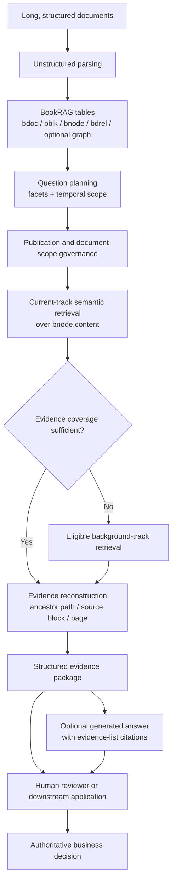
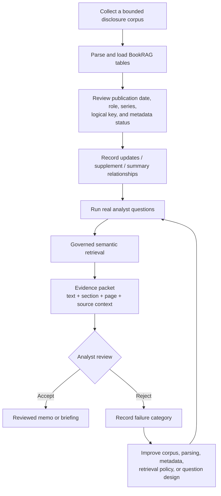

# BookRAG Industrial Use Cases: From Product Claim to Pilot Decision

> **Language:** English | [日本語](bookrag_industrial_use_cases_ja.md)

## Purpose

This is a decision document for product owners, sales teams, solution architects, delivery teams, and domain reviewers. It answers five practical questions:

1. What can the current teradataevsui BookRAG implementation honestly deliver?
2. Which business workflow should be the first commercial target?
3. How should a candidate use case be qualified before a pilot?
4. What must be measured for a go/no-go decision?
5. Which controls and integrations remain outside the current product?

This is not a claim that BookRAG can make regulated, financial, legal, clinical, safety, or engineering decisions. It defines evidence-retrieval workflows that remain under human or application control.

## Executive Decision

**Position BookRAG as a governed evidence-retrieval and review layer, not as a general document chatbot or autonomous decision maker.** The product's useful unit is a traceable evidence package: a semantic match plus document identity, publication metadata, section hierarchy, page/source context, governed document relationships, and optional entity context.

The recommended first commercial workflow is **periodic disclosure and financial-report review**. It has a strong current fit because the work is repeated, documents are long and structured, publication order matters, reviewers need exact source locations, and a useful first pilot does not require BookRAG to calculate financial metrics or make an investment decision.

Secondary targets are policy/control review, regulated quality investigations, and technical service-bulletin or maintenance-document review. They should be pursued only where the initial deliverable is an evidence pack and the authoritative decision remains with a qualified reviewer.

This recommendation is a product hypothesis to validate, not a market-size claim. It is supported by two observable conditions:

- Public filing systems such as [SEC EDGAR](https://www.sec.gov/search-filings) expose recurring, date- and issuer-scoped disclosure corpora, making the workflow reproducible and testable.
- The [NIST AI Risk Management Framework](https://www.nist.gov/itl/ai-risk-management-framework) and its [Generative AI Profile](https://www.nist.gov/publications/artificial-intelligence-risk-management-framework-generative-artificial-intelligence) emphasize risk management and evaluation across the AI lifecycle. teradataevsui therefore treats human review, measurable evidence quality, and explicit production controls as design requirements.

## 1. Current Product Contract

### What BookRAG does



For each retained `(doc_id, node_id)` match, the current implementation can provide:

| Evidence field | Current behavior |
|---|---|
| Semantic match | Searches `bnode.content` through the selected Vector Store |
| Document scope | Uses publication metadata, document role/series, and `bdrel.updates` governance when configured |
| Structure | Reconstructs the matched node's ancestor section chain |
| Source | Resolves the source `bblk` element, pages, text, table HTML, and image context when available |
| Document metadata | Attaches filename, publication date, logical key, revision, role, series, and metadata status |
| Document relationships | Attaches labels such as `updates`, `summary_of`, `supplement_to`, and `next_issue_of` |
| Optional graph context | Attaches document-scoped entity mentions and relations when graph tables exist |
| API output | Returns structured evidence from `/api/bookrag/retrieve` and can generate an answer from `/api/bookrag/answer` |

The answer endpoint cites the evidence list used for generation. Those citations are evidence candidates, not verified claim-to-source alignments.

### What BookRAG does not do by itself

| Unsupported claim | What is actually required |
|---|---|
| Automatic cross-document comparison | Orchestration that retrieves both scopes, aligns comparable facts, and evaluates differences |
| Knowledge-graph traversal | Entity resolution, graph storage/query semantics, traversal policy, and evaluation |
| Domain calculations | Authoritative structured data, calculation logic, controls, and reconciliation |
| Complete corpus assurance | Source-system inventory, ingestion monitoring, completeness checks, and ownership |
| Legal, clinical, safety, credit, or engineering judgment | Qualified reviewers and the organization's approval workflow |
| Verified citations for every generated claim | Claim decomposition and claim-to-evidence verification |
| Enterprise authorization and audit | Identity integration, document-level authorization, durable audit records, and retention policy |

Document relationships enrich an already matched document; they are not retrieval edges. Entity IDs are document-scoped; they are not enterprise master-data identities.

## 2. Use-Case Qualification

### Mandatory gates

A pilot should start only when every gate below has a credible answer:

1. **Named workflow:** one repeatable review task is defined more narrowly than “search company knowledge.”
2. **Named reviewer:** a person or team owns evidence acceptance and the final decision.
3. **Governed corpus:** the source set, document identity, effective date, and version relationships can be established.
4. **Evidence-shaped output:** the first useful deliverable is a review packet, not an autonomous verdict.
5. **Measurable baseline:** current search time and representative completed cases are available.
6. **Bounded dependency:** the first pilot can create value without real-time integration with many operational systems.
7. **Safe failure mode:** an incomplete or wrong retrieval is reviewable before it affects an authoritative decision.

If any gate fails, narrow the workflow or defer the pilot.

### Weighted scorecard

Rate each factor from 1 (weak) to 5 (strong), then calculate `sum(weight × rating / 5)`. The thresholds are planning heuristics and must be calibrated with customer evidence.

| Factor | Weight | A rating of 5 means |
|---|---:|---|
| Traceability need | 20 | Reviewers must return to exact sections, pages, tables, or source elements |
| Repetition and volume | 15 | The same evidence task occurs frequently across cases or reporting periods |
| Document complexity | 15 | Long structure, revisions, tables, or mixed content make ordinary search costly |
| Cost of missed evidence | 15 | Missing material evidence creates significant rework or review risk |
| Current-product fit | 15 | Semantic retrieval plus evidence reconstruction delivers a useful first version |
| Metadata readiness | 10 | Document IDs, dates, roles, and supersession relationships can be governed |
| Integration independence | 10 | The pilot is useful before live transactional or telemetry integration |

Interpretation:

- **80–100: strong pilot candidate.** Proceed if all mandatory gates pass.
- **65–79: conditional candidate.** First remove the largest metadata or integration dependency.
- **Below 65: defer or use Multi-Format.** BookRAG complexity is unlikely to be justified for the first release.

Use `Multi-Format` instead when ordinary chunks meet the measured retrieval target, source provenance below the chunk level is unnecessary, or the workload is a low-risk FAQ/search experience.

## 3. Recommended Beachhead: Periodic Disclosure Review

### Job to be done

When a new annual report, quarterly report, results presentation, correction, or related disclosure arrives, an analyst must quickly assemble the current source evidence for a briefing or review note and allow another reviewer to return to the original document location.

### Buyer, user, and deliverable

| Role | Responsibility |
|---|---|
| Economic buyer | Research, credit-risk, investor-relations, internal-audit, or data/AI leadership |
| Primary user | Analyst who locates and interprets disclosure evidence |
| Reviewer | Senior analyst, committee secretary, audit reviewer, or subject-matter specialist |
| teradataevsui deliverable | Ranked evidence packages with document/date/section/page/source provenance |
| Downstream deliverable | Reviewed briefing, variance note, research memo, or issue list |

### In-scope corpus

- Annual and quarterly reports
- Results presentations and prepared remarks
- Current-event disclosures and material announcements
- Corrections, supplements, and restatements
- Relevant accounting-policy, risk, governance, and technical appendices

Structured financial facts, market prices, forecasts, and portfolio/exposure data remain external inputs. EDGAR also exposes submissions history and extracted XBRL data through official APIs, but those structured facts are a separate integration from BookRAG document evidence. See the [SEC EDGAR API documentation](https://www.sec.gov/search-filings/edgar-application-programming-interfaces).

### Operating workflow



### Questions the current product can support

- Where does management explain a material KPI movement, and which nearby table or note should be reviewed?
- Which current disclosure contains guidance, risk, liquidity, covenant, or accounting-policy evidence relevant to the question?
- Which document updates, supplements, summarizes, or follows an earlier document?
- What section/page evidence should be assembled before a period-over-period comparison performed by an analyst or downstream application?

The last question deliberately stops at evidence assembly. teradataevsui does not itself perform a complete period-over-period calculation or contradiction analysis.

### Suggested first-pilot envelope

Treat these as starting constraints, not universal targets:

- One reviewer team and one recurring report type
- One to three issuers or business entities
- Two to four reporting periods
- Approximately 20–60 governed documents
- Approximately 40–80 real questions sampled from completed work
- A baseline using the current search/review method
- At least one qualified reviewer who did not build the retrieval configuration

Avoid live workflow integration in the first evaluation. Prove evidence quality and time-to-evidence before adding source-system IDs, automated ingestion, or report generation.

### Pilot metrics

Thresholds must be agreed before testing; they should not be selected after seeing the results.

| Metric | Definition | Why it matters |
|---|---|---|
| Evidence recall@k | Share of expected material source passages present in the top-k packages | Measures missed evidence |
| Source-locator accuracy | Share of returned filename/section/page locators that lead to the intended source | Measures traceability |
| Current-document precision | Share of accepted packages drawn from the correct effective document scope | Measures governance quality |
| Reviewer acceptance rate | Share of returned packages accepted as useful without source replacement | Measures operational usefulness |
| Critical-miss rate | Share of questions where a reviewer finds material evidence absent from the result | Protects against misleading completeness |
| Median time-to-evidence | Time from question receipt to an accepted source packet, compared with baseline | Measures economic value |
| Rework rate | Share of packets returned for wrong document, context, or locator | Measures downstream friction |

### Go, iterate, or stop

- **Go:** agreed safety/quality thresholds pass, time-to-evidence improves, and reviewer trust is stable across held-out questions.
- **Iterate:** failures are concentrated in correctable parsing, hierarchy, metadata, or retrieval-policy categories.
- **Stop or narrow:** useful answers depend mainly on missing live data, calculations, undocumented expert judgment, or unrestricted cross-corpus reasoning.

## 4. Expansion Portfolio

The following rows are hypotheses, not validated priorities. Apply the mandatory gates and scorecard for each customer corpus.

| ID | Workflow | Evidence job | Dominant external dependency | Initial fit hypothesis |
|---|---|---|---|---|
| FIN-DISC-01 | Periodic disclosure and financial-report review | Assemble current, source-located disclosure evidence | Structured facts and analyst judgment | Strong / beachhead |
| FIN-01 | Project-finance annual credit review | Locate covenant, risk, and technical-report evidence | Exposure, spreading, covenant calculations, approvals | Conditional |
| FIN-02 | Regulatory change review | Locate new obligations and candidate policy/control passages | Jurisdiction, applicability, control mapping, legal interpretation | Strong if scope is bounded |
| FIN-03 | Industrial property and business-interruption claim review | Assemble policy, endorsement, and incident evidence | Policy period, loss data, calculations, legal privilege | Conditional |
| MED-01 | Medical-device safety notice review | Locate model/version warnings and related local procedures | Installed-device inventory and clinical governance | Conditional |
| LIFE-01 | Batch deviation and CAPA evidence | Assemble effective requirements and prior-investigation evidence | Batch/equipment data, signatures, quality workflow | Strong for evidence preparation |
| LIFE-02 | Clinical-trial safety review preparation | Locate protocol, reference-safety, method, and result evidence | Subject data, coding, statistics, unblinding controls | Conditional/high control |
| FOOD-01 | Contamination or recall investigation | Locate limits, methods, procedures, and prior-event evidence | Lot genealogy, inventory, lab results, recall authority | Conditional |
| WATER-01 | Drinking-water excursion review | Locate limits, methods, operating procedures, and prior events | Live measurements, permit scope, affected population | Conditional |
| ENERGY-01 | Transformer outage work-package preparation | Locate OEM warnings, limits, procedures, and prior maintenance | Asset identity, condition data, switching and work authority | Strong for preparation |
| CHEM-01 | Management-of-change evidence review | Locate operating limits, hazards, procedures, and prior changes | P&ID topology, calculations, process conditions, approval | Strong for evidence preparation |
| SEMI-01 | Yield-excursion evidence collection | Locate specifications, failure modes, changes, and prior investigations | Wafer/lot/SPC/tool telemetry and experiment data | Conditional |
| AERO-01 | Requirement-change verification evidence | Locate requirements, assumptions, verification, and certification evidence | Baselines, formal traceability, configuration status | Conditional/high control |
| SUPPLY-01 | Supplier material/process change review | Locate specifications, qualification, audit, and commitment evidence | Supplier/part/BOM/lot identity and approval workflow | Conditional |
| CLIMATE-01 | Flood-resilience investment evidence | Locate hazard assumptions, options, policies, and prior-event evidence | GIS, models, asset/population data, engineering economics | Defer unless document-only subtask is isolated |

### Reusable use-case definition

Do not approve a use case from its industry label. Complete this brief:

```yaml
use_case_id:
workflow_name:
trigger:
primary_user:
authoritative_reviewer:
decision_supported:
document_corpus:
representative_questions:
bookrag_evidence_output:
external_data_required:
out_of_scope_decisions:
baseline_process:
pilot_metrics:
acceptance_thresholds:
production_owner:
```

## 5. Pilot Delivery Sequence

| Phase | Work | Exit condition |
|---|---|---|
| 0. Qualify | Complete gates, scorecard, decision owner, and risk boundary | Named workflow and reviewer; bounded corpus; measurable baseline |
| 1. Govern corpus | Assign stable `doc_id`; confirm publication metadata, roles, series, and `updates` relationships | No unexplained duplicate/current-version ambiguity in pilot corpus |
| 2. Build ground truth | Sample real questions and label expected source passages with domain reviewers | Reviewable question set with source locators and materiality labels |
| 3. Configure and test | Evaluate parsing, hierarchy, retrieval policy, evidence reconstruction, and answer behavior separately | Failure categories and metric results are reproducible |
| 4. Run blind pilot | Compare BookRAG-assisted and baseline evidence work on held-out questions | Pre-agreed quality and time thresholds pass |
| 5. Production design | Add identity, authorization, ingestion, monitoring, retention, and approval integration | Operational and control owners accept residual risk |

### Failure taxonomy

Every rejected or missed result should have one primary category:

- **Corpus:** required document was absent.
- **Parsing:** relevant text/table/image was not extracted correctly.
- **Hierarchy:** heading, section path, or parent relationship was wrong.
- **Metadata:** publication date, role, logical key, or status was wrong/missing.
- **Governance:** an obsolete or out-of-scope document remained eligible.
- **Retrieval:** the correct node existed but did not rank within the candidate budget.
- **Reconstruction:** the node matched, but ancestor/source/entity context was incomplete.
- **Generation:** evidence was adequate, but the answer misstated or omitted it.
- **External dependency:** the question required structured/live data or domain logic not present in BookRAG.

This taxonomy prevents prompt changes from being used to hide corpus, metadata, or integration failures.

## 6. Production Controls and Ownership

| Control area | Current teradataevsui support | Required production decision |
|---|---|---|
| Authentication | SQLite users, Argon2 passwords, expiring/revocable server sessions, API token | Enterprise identity, MFA/SSO, service identity, token lifecycle |
| Authorization | Admin-enforced user management and request-level UI separation | Corpus/document/row-level access aligned with source permissions |
| Session durability | Identity/session records survive restart; connection/form/chat state remains process-local | Shared state store for multi-replica recovery and background work |
| Audit | Authentication events, operational response details, and local manifests | Durable retrieval, metadata-change, export, and approval logs with retention policy |
| Document governance | Metadata and relationship administration | Source ownership, ingestion SLA, completeness, effective-date rules |
| Data protection | Ignored local secrets and upload paths | Encryption, secret manager, malware scanning, retention, deletion, legal hold |
| Model governance | Configurable retrieval policy and measurable outputs | Versioning, change approval, regression suite, drift monitoring, rollback |
| Human approval | Evidence is visible to a reviewer | Named authority and workflow control before consequential action |
| Availability | Single-process FastAPI application | Capacity, concurrency, background jobs, monitoring, backup, and recovery |

High-impact deployments should align evaluation and control design with the organization's applicable governance framework. NIST's [AI Resource Center](https://airc.nist.gov/) is one public source for testing, evaluation, verification, and validation practices; it does not replace sector-specific obligations.

## 7. Approved Product Language

| Say | Avoid |
|---|---|
| “Returns traceable evidence candidates with document and source context.” | “Produces verified citations for every claim.” |
| “Uses document metadata and explicit update relationships to govern eligible evidence.” | “Always knows the latest truth.” |
| “Adds document-scoped entity context when available.” | “Builds an enterprise knowledge graph.” |
| “Reduces evidence search and review effort when pilot metrics pass.” | “Automates the analyst, auditor, engineer, clinician, or lawyer.” |
| “Supports a reviewed downstream decision.” | “Makes compliant or safe decisions autonomously.” |
| “Can be integrated with structured systems for calculations and applicability.” | “Performs calculations or real-time operational reasoning from documents alone.” |

## 8. Related Implementation References

- [teradataevsui overall design and setup](../README.md#overall-design)
- [BookRAG pipeline and data structures](bookrag_pipeline_diagram.md)
- [Latest-document governance](bookrag_latest_document_governance.md)
- `GET /api/bookrag/schema` for authoritative physical table names and join contracts
- `GET|POST /api/bookrag/retrieve` for structured evidence
- `GET|POST /api/bookrag/answer` for evidence-grounded answer generation
- `app/config/bookrag_retrieval_policy.json` for candidate budgets, ranking, coverage, diversity, and governance policy

The production claim should always be the narrowest claim supported by the measured workflow, corpus, and controls.
