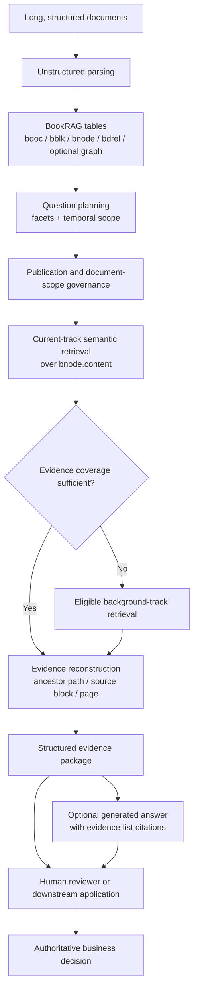
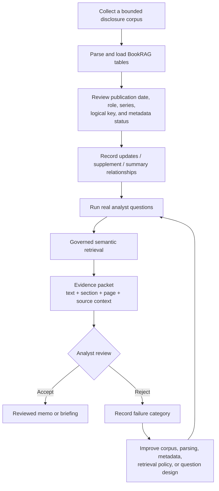

# BookRAG 産業ユースケース：製品訴求から実証判断まで

> **言語:** [English](bookrag_industrial_use_cases.md) | 日本語
<!-- Source-SHA256: 5013a0808686fa6f2b0c5c3d8925d63dbbb4dcc05e29e6abd4df87184d80f8a8 -->

## 本書の目的

本書は、プロダクト責任者、営業、ソリューションアーキテクト、導入チーム、業務審査者のための意思決定資料です。次の5点を明確にします。

1. 現行 teradataevsui BookRAG が実際に提供できるもの
2. 最初に狙うべき商用業務
3. 実証前にユースケースを選別する方法
4. Go / No-Go のために測定すべき指標
5. 現行製品の外側に残る統制・連携要件

BookRAG が規制、金融、法務、臨床、安全、技術上の判断を自動で行えると主張する文書ではありません。人または外部アプリケーションが最終責任を持つ、根拠検索業務を定義します。

## 結論

**BookRAG は、汎用文書チャットや自律判断機能ではなく、統制された根拠検索・審査レイヤーとして位置付けます。** 製品で有用な単位となるのは、意味検索結果に文書 ID、発行情報、章階層、ページ・元要素、文書関係、任意のエンティティ文脈を付加した「追跡可能なエビデンスパッケージ」です。

最初の商用候補には **定期開示・財務報告レビュー** を推奨します。反復業務であること、長く構造化された文書を扱うこと、発行順序が重要であること、原文位置に戻れる必要があること、財務計算や投資判断を自動化しなくても限定的な実証価値を出せることが理由です。

次点は、方針・統制レビュー、規制産業の品質調査、サービス通知・保全資料レビューです。いずれも初期成果物を「審査用根拠パック」に限定し、有資格者が最終判断する場合にのみ進めます。

この優先順位は市場規模の断定ではなく、検証すべき製品仮説です。背景となる観察事実は次のとおりです。

- [SEC EDGAR](https://www.sec.gov/search-filings) のような公開提出システムは、日付と企業で範囲を定められる反復的な開示コーパスを提供しており、この業務を再現可能かつテスト可能にします。
- [NIST AI Risk Management Framework](https://www.nist.gov/itl/ai-risk-management-framework) と [Generative AI Profile](https://www.nist.gov/publications/artificial-intelligence-risk-management-framework-generative-artificial-intelligence) は、AI ライフサイクル全体のリスク管理と評価を重視しています。このため teradataevsui でも、人による審査、測定可能な根拠品質、明示的な本番統制を設計条件とします。

## 1. 現行製品の契約

### BookRAG が行うこと



保持された `(doc_id, node_id)` ごとに、現行実装は次の情報を提供できます。

| 根拠項目 | 現行動作 |
|---|---|
| 意味一致 | 選択した Vector Store で `bnode.content` を検索 |
| 文書スコープ | 設定済みの場合、発行情報、文書 role/series、`bdrel.updates` を使用 |
| 構造 | 一致 node の上位章チェーンを再構成 |
| 元情報 | `bblk` の元要素、ページ、本文、表 HTML、画像文脈を可能な範囲で付加 |
| 文書メタデータ | filename、発行日、logical key、revision、role、series、status を付加 |
| 文書関係 | `updates`、`summary_of`、`supplement_to`、`next_issue_of` などを付加 |
| 任意グラフ文脈 | グラフテーブルがある場合、文書内エンティティの出現と関係を付加 |
| API | `/api/bookrag/retrieve` で構造化根拠、`/api/bookrag/answer` で回答生成 |

回答 API の citation は、生成に使用したエビデンス一覧を示します。各主張が原文で検証済みであることを保証するものではありません。

### BookRAG 単体では行わないこと

| 不適切な訴求 | 実際に必要なもの |
|---|---|
| 文書横断の自動比較 | 両方の対象を検索し、比較可能な事実を対応付け、差分を評価するオーケストレーション |
| 知識グラフ探索 | エンティティ統合、グラフ保存・照会、探索ポリシー、評価 |
| 専門計算 | 正式な構造化データ、計算ロジック、統制、照合 |
| コーパス完全性の保証 | 元システム台帳、取込監視、完全性検査、責任者 |
| 法務・臨床・安全・与信・技術判断 | 有資格審査者と組織の承認業務 |
| 生成文の全主張に対する検証済み citation | 主張分解と主張単位の根拠検証 |
| 企業向け認可・監査 | ID 連携、文書単位認可、永続監査、保存ポリシー |

文書関係は、すでに一致した文書に文脈を付けるものであり、追加検索の辺ではありません。エンティティ ID は文書内スコープであり、企業マスターデータではありません。

## 2. ユースケースの選別

### 必須ゲート

次の全項目に具体的な回答がある場合のみ、実証を開始します。

1. **業務名:** 「社内知識を検索」より狭い、一つの反復審査業務が定義されている。
2. **審査者:** 根拠採否と最終判断を担当する人・チームが決まっている。
3. **統制コーパス:** 文書集合、文書 ID、発効日、版関係を確立できる。
4. **根拠型成果物:** 最初の有用な成果が自動判定ではなく審査パックである。
5. **測定可能な基準:** 現在の検索時間と、完了案件の代表例がある。
6. **限定された外部依存:** 多数のリアルタイム業務システムをつながなくても初期価値が出る。
7. **安全な失敗:** 不完全・誤検索が正式判断に影響する前に人が確認できる。

一つでも満たさない場合は、業務を狭めるか実証を延期します。

### 加重スコア

各項目を 1（弱い）～5（強い）で評価し、`sum(weight × rating / 5)` を計算します。閾値は計画用の仮説であり、顧客データで調整します。

| 評価項目 | 重み | 5点の状態 |
|---|---:|---|
| 追跡性の必要性 | 20 | 正確な章、ページ、表、元要素へ戻る必要がある |
| 反復性・件数 | 15 | 同じ根拠業務が案件・期間ごとに頻繁に発生する |
| 文書複雑性 | 15 | 長い構造、改訂、表、混合形式が通常検索を難しくする |
| 見落としコスト | 15 | 重要根拠の見落としが大きな再作業・審査リスクになる |
| 現行製品適合 | 15 | 意味検索と根拠再構成だけで有用な初版になる |
| メタデータ準備度 | 10 | 文書 ID、日付、role、版関係を統制できる |
| 外部連携非依存 | 10 | 取引・センサー等のリアルタイム連携前でも価値がある |

目安:

- **80～100:** 強い実証候補。必須ゲートをすべて満たす場合に開始。
- **65～79:** 条件付き。最大のメタデータ・連携依存を先に除去。
- **65未満:** 延期または `Multi-Format` を使用。初期段階では BookRAG の複雑性を正当化しにくい。

通常チャンクで測定済みの検索目標を満たせる場合、チャンクより細かい出典追跡が不要な場合、または低リスクの FAQ／検索業務である場合は、`Multi-Format` を選びます。

## 3. 最初の切り口：定期開示レビュー

### 業務ジョブ

年次報告、四半期報告、決算説明、訂正、関連開示が追加されたとき、アナリストがブリーフィングや審査メモに必要な最新根拠を短時間で集め、別の審査者が原文位置に戻れるようにします。

### 買い手、利用者、成果物

| 役割 | 責任 |
|---|---|
| 経済的買い手 | リサーチ、与信リスク、IR、内部監査、データ/AI 責任者 |
| 主利用者 | 開示根拠を検索・解釈するアナリスト |
| 審査者 | シニアアナリスト、委員会事務局、監査審査者、専門家 |
| teradataevsui 成果物 | 文書・日付・章・ページ・元要素付きの順位付けされた根拠 |
| 下流成果物 | 審査済みブリーフィング、差異メモ、調査メモ、論点一覧 |

### 対象文書

- 年次・四半期報告
- 決算説明資料、経営陣による説明原稿
- 適時開示、重要発表
- 訂正、補足、修正版
- 関連する会計方針、リスク、ガバナンス、技術付録

構造化財務数値、市場価格、予測、ポートフォリオ・エクスポージャーは外部入力です。EDGAR は提出履歴と XBRL データを公式 API で提供していますが、構造化数値連携は BookRAG の文書根拠とは別の機能です。[SEC EDGAR API 文書](https://www.sec.gov/search-filings/edgar-application-programming-interfaces)を参照してください。

### 運用フロー



### 現行製品で扱える質問

- 重要 KPI の変化を説明している箇所はどこか。近接する表・注記のどれを確認すべきか。
- ガイダンス、リスク、流動性、コベナンツ、会計方針に関する現在の根拠はどの開示にあるか。
- どの文書が以前の文書を更新、補足、要約、後継しているか。
- アナリストまたは外部アプリが期間比較する前に、どの章・ページ根拠を集めるべきか。

最後の質問は根拠収集までです。teradataevsui 単体は、完全な期間比較計算や矛盾分析を行いません。

### 初回実証の目安

普遍的な基準ではなく、開始時の制約として使用します。

- 一つの審査チーム、一つの反復報告業務
- 1～3 社または事業体
- 2～4 報告期間
- 約 20～60 件の統制済み文書
- 完了業務から抽出した約 40～80 問
- 現行検索・審査方法のベースライン
- 検索設定を作成していない有資格審査者を少なくとも一名含める

初回評価ではライブ業務連携を避けます。元システム ID、自動取込、レポート生成を追加する前に、根拠品質と time-to-evidence を証明します。

### 実証指標

合否閾値はテスト前に合意し、結果を見てから選びません。

| 指標 | 定義 | 目的 |
|---|---|---|
| Evidence recall@k | 期待される重要原文のうち top-k パッケージに含まれた割合 | 根拠見落としを測る |
| 出典位置精度 | filename・章・ページが意図した原文位置へ到達する割合 | 追跡性を測る |
| 現行文書 precision | 採用根拠のうち正しい発効文書スコープから取得した割合 | 文書統制を測る |
| 審査者採用率 | 原文差し替えなしで有用と判断されたパッケージの割合 | 業務有用性を測る |
| 重要見落とし率 | 審査者が検索結果外の重要根拠を発見した質問の割合 | 不適切な完全性期待を防ぐ |
| 中央 time-to-evidence | 質問受付から採用根拠パックまでの時間をベースラインと比較 | 経済価値を測る |
| 再作業率 | 文書、文脈、位置誤りで差し戻されたパッケージの割合 | 下流負荷を測る |

### Go / 改善 / 中止

- **Go:** 合意した安全・品質閾値を満たし、time-to-evidence が改善し、検証用に留保した質問でも審査者の信頼が安定。
- **改善:** 失敗が解析、階層、メタデータ、検索ポリシーなど修正可能な原因に集中。
- **中止・縮小:** 有用な回答が、欠けているライブデータ、計算、暗黙の専門判断、無制限な文書横断推論に大きく依存。

## 4. 拡張候補

次表は検証済み優先順位ではなく仮説です。顧客コーパスごとに必須ゲートとスコアを適用します。

| ID | 業務 | 根拠ジョブ | 主な外部依存 | 初期適合仮説 |
|---|---|---|---|---|
| FIN-DISC-01 | 定期開示・財務報告レビュー | 現行開示根拠を出典位置付きで収集 | 構造化数値、アナリスト判断 | 強い / 最初の切り口 |
| FIN-01 | プロジェクトファイナンス年次与信 | コベナンツ、リスク、技術報告の根拠 | エクスポージャー、財務分析、計算、承認 | 条件付き |
| FIN-02 | 規制変更レビュー | 新規義務と方針・統制候補を特定 | 法域、適用性、統制 mapping、法的解釈 | 範囲限定なら強い |
| FIN-03 | 企業財産・利益保険の保険金審査 | 約款、特約、事故根拠を収集 | 保険期間、損害データ、計算、秘匿特権 | 条件付き |
| MED-01 | 医療機器安全通知レビュー | 型式・版の警告と院内手順を特定 | 機器台帳、臨床ガバナンス | 条件付き |
| LIFE-01 | バッチ逸脱・CAPA 根拠 | 発効要件と過去調査を収集 | バッチ/設備データ、署名、品質業務 | 根拠準備には強い |
| LIFE-02 | 臨床試験安全性レビュー準備 | プロトコル、参照安全性情報、方法、結果根拠 | 被験者データ、コーディング、統計、盲検管理 | 条件付き / 高統制 |
| FOOD-01 | 汚染・回収調査 | 限度、方法、手順、過去事例を特定 | ロット系譜、在庫、試験、回収権限 | 条件付き |
| WATER-01 | 飲料水基準値逸脱 | 限度、方法、運転手順、過去事例を特定 | ライブ測定、許可範囲、対象人口 | 条件付き |
| ENERGY-01 | 変圧器停止工事パッケージ | OEM 警告、限度、手順、過去保全を特定 | 設備 ID、状態、開閉・作業権限 | 準備業務には強い |
| CHEM-01 | 変更管理の根拠レビュー | 運転限度、危険、手順、過去変更を特定 | P&ID、計算、工程条件、承認 | 根拠準備には強い |
| SEMI-01 | 歩留まり異常の根拠収集 | 仕様、故障モード、変更、過去調査を特定 | wafer/lot/SPC/tool telemetry、実験 | 条件付き |
| AERO-01 | 要求変更の検証根拠 | 要求、前提、検証、認証根拠を特定 | ベースライン、正式なトレーサビリティ、構成状態 | 条件付き / 高統制 |
| SUPPLY-01 | サプライヤー材料・工程変更 | 仕様、認定、監査、約束事項を特定 | supplier/part/BOM/lot ID、承認業務 | 条件付き |
| CLIMATE-01 | 洪水レジリエンス投資 | ハザード前提、案、方針、過去事例を特定 | GIS、モデル、設備・人口、技術経済計算 | 文書限定業務を分離できなければ延期 |

### 再利用可能な定義テンプレート

業界名だけで承認せず、次の brief を完成させます。

```yaml
use_case_id:
workflow_name:
trigger:
primary_user:
authoritative_reviewer:
decision_supported:
document_corpus:
representative_questions:
bookrag_evidence_output:
external_data_required:
out_of_scope_decisions:
baseline_process:
pilot_metrics:
acceptance_thresholds:
production_owner:
```

## 5. 実証の進め方

| フェーズ | 作業 | 完了条件 |
|---|---|---|
| 0. 選別 | 必須ゲート、スコア、判断責任者、リスク境界を確定 | 業務・審査者・限定コーパス・baseline が明確 |
| 1. コーパス統制 | stable `doc_id`、発行情報、role、series、`updates` を確認 | 現行版の重複・曖昧さが説明済み |
| 2. 正解作成 | 実質問を抽出し、専門家が期待原文と重要度を付与 | 原文位置付きの審査可能な質問集合 |
| 3. 設定・試験 | 解析、階層、検索、根拠再構成、回答を個別評価 | 失敗分類と測定結果を再現可能 |
| 4. ブラインド実証 | 検証用に留保した質問で BookRAG 支援とベースラインを比較 | 事前合意した品質・時間基準を達成 |
| 5. 本番設計 | ID、認可、取込、監視、保存、承認を連携 | 業務・統制責任者が残余リスクを受容 |

### 失敗分類

却下・見落としには主原因を一つ付けます。

- **Corpus:** 必要文書が存在しない。
- **Parsing:** 必要な本文・表・画像が正しく抽出されない。
- **Hierarchy:** 見出し、章 path、親子関係が誤る。
- **Metadata:** 発行日、role、logical key、status が誤る・欠ける。
- **Governance:** 旧版・対象外文書が検索対象に残る。
- **Retrieval:** 正しい node はあるが候補数内に入らない。
- **Reconstruction:** node は一致したが上位章・元要素・entity 文脈が不足。
- **Generation:** 根拠は十分だが回答が誤記・欠落する。
- **External dependency:** BookRAG にない構造化/ライブデータや専門ロジックが必要。

この分類により、コーパス・メタデータ・連携の問題を prompt 変更で隠すことを防ぎます。

## 6. 本番統制と責任

| 統制領域 | 現行 teradataevsui | 本番で決めること |
|---|---|---|
| 認証 | SQLite ユーザー、Argon2 パスワード、有効期限・失効機能を持つサーバーセッション、API トークン | 企業 ID 基盤、MFA／SSO、サービス ID、トークンのライフサイクル |
| 認可 | 管理者が実施するユーザー管理とリクエスト単位の UI 分離 | 元システムの権限と一致するコーパス／文書／行レベルのアクセス制御 |
| セッションの永続性 | ID 情報とセッション記録は再起動後も保持され、接続／フォーム／チャット状態はプロセス内に保持 | 複数レプリカの復旧とバックグラウンド処理に対応する共有状態ストア |
| 監査 | 認証イベント、操作応答の詳細、ローカルマニフェスト | 検索、メタデータ変更、エクスポート、承認に関する永続ログと保持ポリシー |
| 文書統制 | メタデータと文書関係の管理 | ソース責任者、取り込み SLA、完全性、発効日規則 |
| データ保護 | Git 対象外のシークレットとアップロードパス | 暗号化、シークレット管理、マルウェアスキャン、保持、削除、訴訟ホールド |
| モデルガバナンス | 設定可能な検索ポリシーと測定可能な出力 | バージョン管理、変更承認、回帰試験、ドリフト監視、ロールバック |
| 人的承認 | レビュアーが確認できるエビデンス | 重大な操作の前に適用する正式な権限とワークフロー統制 |
| 可用性 | 単一プロセスの FastAPI アプリケーション | 容量、同時実行性、バックグラウンドジョブ、監視、バックアップ、復旧 |

高影響用途では、組織に適用されるガバナンス枠組みに沿って評価・統制を設計します。NIST の [AI Resource Center](https://airc.nist.gov/) は、テスト、評価、検証、および妥当性確認に関する公開資料の一つですが、業界固有の義務を代替しません。

## 7. 製品表現

| 使用する表現 | 避ける表現 |
|---|---|
| 「文書と元要素の文脈を持つ追跡可能な根拠候補を返す」 | 「すべての主張に検証済み citation を付ける」 |
| 「metadata と明示的な更新関係で検索対象を統制する」 | 「常に最新の真実を理解する」 |
| 「利用可能な場合、文書内 entity 文脈を付加する」 | 「企業知識グラフを構築する」 |
| 「実証指標を満たす場合、根拠検索・審査工数を削減する」 | 「アナリスト、監査人、技術者、臨床家、法務を自動化する」 |
| 「人が審査する下流判断を支援する」 | 「適法・安全な判断を自律的に行う」 |
| 「構造化システムと連携して計算・適用性を扱える」 | 「文書だけで計算・リアルタイム運用推論を行う」 |

## 8. 実装資料

- [teradataevsui 全体設計とセットアップ](../README_ja.md#全体設計)
- [BookRAG pipeline とデータ構造](bookrag_pipeline_diagram_ja.md)
- [最新文書の統制](bookrag_latest_document_governance_ja.md)
- `GET /api/bookrag/schema`: 正式な物理テーブル名と結合契約
- `GET|POST /api/bookrag/retrieve`: 構造化されたエビデンス
- `GET|POST /api/bookrag/answer`: エビデンスに基づく回答生成
- `app/config/bookrag_retrieval_policy.json`: 候補数、順位付け、網羅性、多様性、およびガバナンスポリシー

本番で使用する主張は、測定済みの業務、コーパス、統制が裏付ける最小範囲に限定します。
